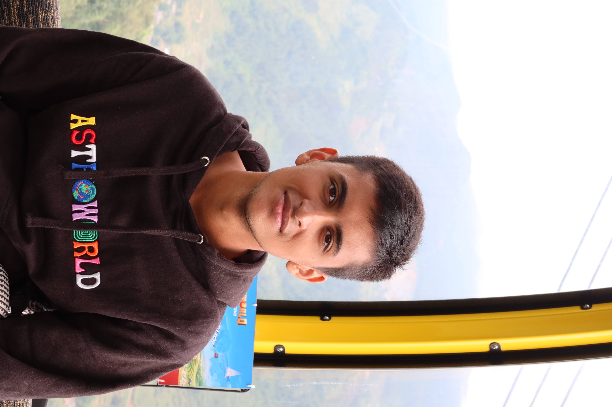
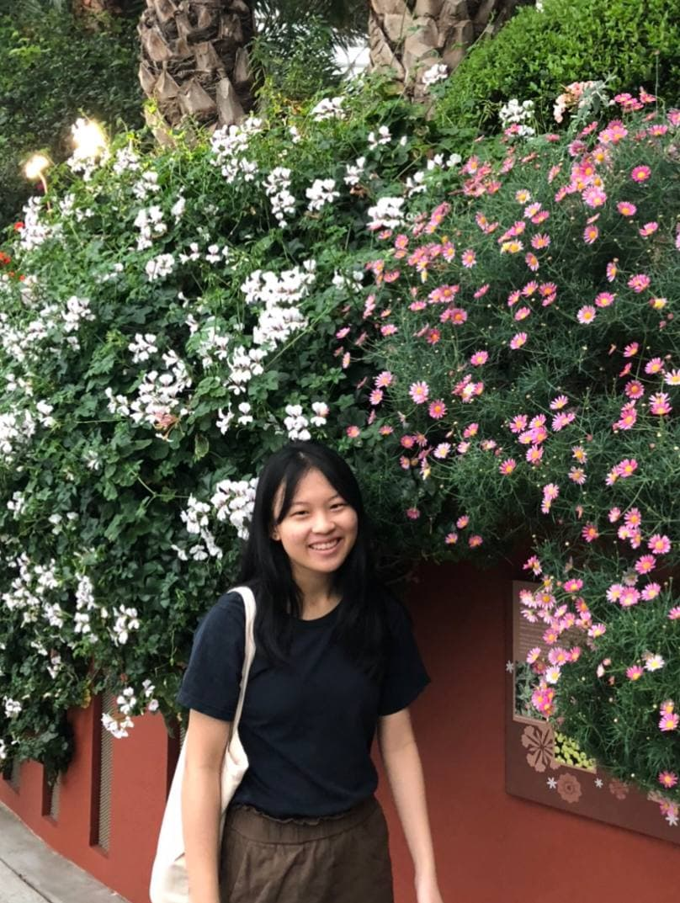
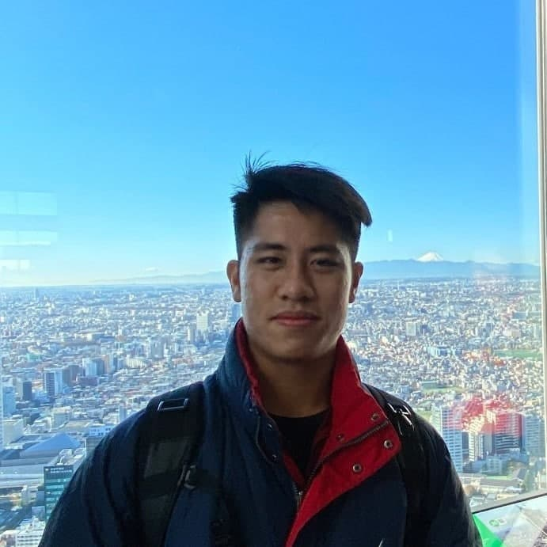

We are a team based in the [School of Computing, National University of Singapore](http://www.comp.nus.edu.sg).

## Project team

### Zhang Zhikai

[[github](http://github.com/zzhikai)]
[[portfolio](team/zzhikai.md)]

* Role: Team Lead
* Responsibilities: Code quality + Integration

### Goel Akshit

[[github](https://github.com/goel-a)]
[[portfolio](team/goel-a.md)]

* Role: Developer
* Responsibilities: Code Quality + Deliverables & Deadlines

### Ryan Cheung

[[github](http://github.com/RyanCheungJF)]
[[portfolio](team/ryancheungjf.md)]

* Role: Developer
* Responsibilities: Documentation + Scheduling

### Chen Kai Yi

[[github](https://github.com/kaiyichen)]
[[portfolio](team/kaiyichen.md)]

* Role: Developer
* Responsibilities: Documentation + Deliverables and deadlines

### Ryan Tan Li En

[[github](http://github.com/ryantanlien)]
[[portfolio](team/ryantanlien.md)]

* Role: Developer
* Responsibilities: Testing + Integration
