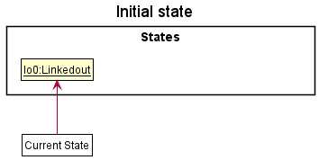
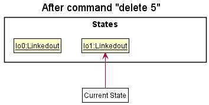
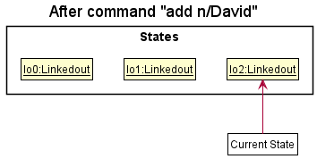
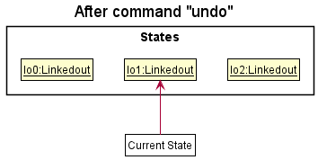
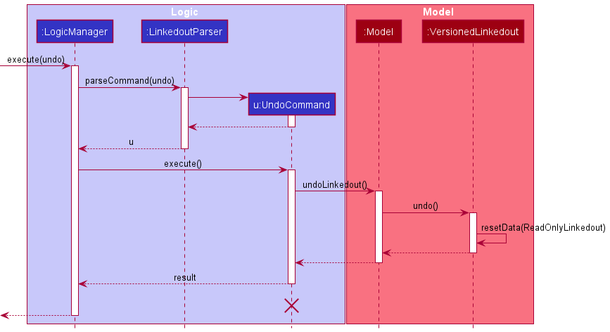
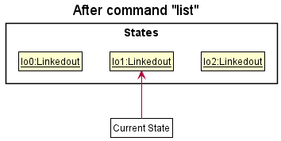
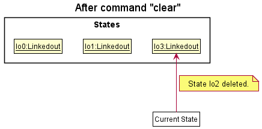
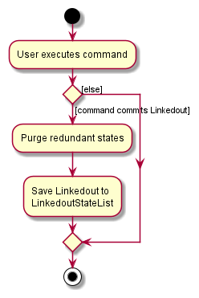

## **Table of Contents**
* Table of Contents
{:toc}

--------------------------------------------------------------------------------------------------------------------

## **Who is this Developer Guide for?**

This user guide is meant for developers who wish to learn about the design decisions and implementation of our application. 
The target audience of our application are recruiters who are looking to incorporate this app into their daily workflows.

Certain technical terms are specified in *italics*. If you need to reference what they mean, you can do so by referring to our [Glossary](https://ay2122s2-cs2103t-t09-2.github.io/tp/DeveloperGuide.html#glossary).

If you would like to learn more about the target group and how the application addresses their concerns, skip ahead to the [Requirements](https://ay2122s2-cs2103t-t09-2.github.io/tp/DeveloperGuide.html#appendix-requirements).

If you would like to learn how to use the application instead, you can do so by reading our [User Guide](https://ay2122s2-cs2103t-t09-2.github.io/tp/UserGuide.html).

[Back to top ](#table-of-contents)

--------------------------------------------------------------------------------------------------------------------

## **Legend for Boxes**

**:information_source: Notes:**
Notes are placed in this guide to specify extra details on the command format and serves as a guide to assist you.

:bulb: **Tip:**
Tips are placed in this guide to serve as suggestions that you can try out while using our application.

:exclamation: **Caution:**
Cautions are placed in this guide to serve as warnings for certain actions.

[Back to top ](#table-of-contents)

--------------------------------------------------------------------------------------------------------------------

## **Acknowledgements**

This project is based on the AddressBook-Level3 project created by the [SE-EDU initiative](https://se-education.org).

[Back to top ](#table-of-contents)

--------------------------------------------------------------------------------------------------------------------

## **Setting up, getting started**

Refer to the guide [_Setting up and getting started_](SettingUp.md).

[Back to top ](#table-of-contents)

--------------------------------------------------------------------------------------------------------------------

## **Design**

:bulb: **Tip:** The `.puml` files used to create diagrams in this document can be found in the [diagrams](https://github.com/AY2122S2-CS2103T-T09-2/tp/tree/master/docs/diagrams) folder. Refer to the [_PlantUML Tutorial_ at se-edu/guides](https://se-education.org/guides/tutorials/plantUml.html) to learn how to create and edit diagrams.

[Back to top ](#table-of-contents)

--------------------------------------------------------------------------------------------------------------------

## **Legend for Diagrams**

The following colour schemes are used in the diagrams. They each refer to a specific component.

-  `Represents UI Component`
-  `Represents Logic Component`
-  `Represents Model Component`
-  `Represents Storage Component`

[Back to top ](#table-of-contents)

---

### Architecture

The ***Architecture Diagram*** given above explains the high-level design of the App.

Given below is a quick overview of main components and how they interact with each other.

**Main components of the architecture**

**`Main`** has two classes called [`Main`](https://github.com/AY2122S2-CS2103T-T09-2/tp/blob/master/src/main/java/seedu/linkedout/Main.java) and [`MainApp`](https://github.com/AY2122S2-CS2103T-T09-2/tp/blob/master/src/main/java/seedu/linkedout/MainApp.java). It is responsible for,
* At app launch: Initializes the components in the correct sequence, and connects them up with each other.
* At shut down: Shuts down the components and invokes cleanup methods where necessary.

[**`Commons`**](#common-classes) represents a collection of classes used by multiple other components.

The rest of the App consists of four components.

* [**`UI`**](#ui-component): The UI of the App.
* [**`Logic`**](#logic-component): The command executor.
* [**`Model`**](#model-component): Holds the data of the App in memory.
* [**`Storage`**](#storage-component): Reads data from, and writes data to, the hard disk.

**How the architecture components interact with each other**

The *Sequence Diagram* below shows how the components interact with each other for the scenario where the user issues the command `delete 1`.

Each of the four main components (also shown in the diagram above),

* defines its *API* in an `interface` with the same name as the Component.
* implements its functionality using a concrete `{Component Name}Manager` class (which follows the corresponding API `interface` mentioned in the previous point.

For example, the `Logic` component defines its *API* in the `Logic.java` interface and implements its functionality using the `LogicManager.java` class which follows the `Logic` interface. Other components interact with a given component through its interface rather than the concrete class (reason: to prevent outside component's being coupled to the implementation of a component), as illustrated in the (partial) class diagram below.

The sections below give more details of each component.

[Back to top ](#table-of-contents)

---
### UI component

The **API** of this component is specified in [`Ui.java`](https://github.com/AY2122S2-CS2103T-T09-2/tp/blob/master/src/main/java/seedu/linkedout/ui/Ui.java)

The UI consists of a `MainWindow` that is made up of parts e.g.`CommandBox`, `ResultDisplay`, `ApplicantListPanel`, `StatusBarFooter` etc. All these, including the `MainWindow`, inherit from the abstract `UiPart` class which captures the commonalities between classes that represent parts of the visible *GUI*.

The `UI` component uses the JavaFx UI framework. The layout of these UI parts are defined in matching `.fxml` files that are in the `src/main/resources/view` folder. For example, the layout of the [`MainWindow`](https://github.com/se-edu/linkedout-level3/tree/master/src/main/java/seedu/address/ui/MainWindow.java) is specified in [`MainWindow.fxml`](https://github.com/se-edu/linkedout-level3/tree/master/src/main/resources/view/MainWindow.fxml)

The `UI` component,

* executes user commands using the `Logic` component.
* listens for changes to `Model` data so that the UI can be updated with the modified data.
* keeps a reference to the `Logic` component, because the `UI` relies on the `Logic` to execute commands.
* depends on some classes in the `Model` component, as it displays `Applicant` object residing in the `Model`.

### Logic component

**API** : [`Logic.java`](https://github.com/AY2122S2-CS2103T-T09-2/tp/blob/master/src/main/java/seedu/linkedout/logic/Logic.java)

Here's a (partial) class diagram of the `Logic` component:

How the `Logic` component works:
1. When `Logic` is called upon to execute a command, it uses the `LinkedoutParser` class to parse the user command.
1. This results in a `Command` object (more precisely, an object of one of its subclasses e.g., `AddCommand`) which is executed by the `LogicManager`.
1. The command can communicate with the `Model` when it is executed (e.g. to add an applicant).
1. The result of the command execution is encapsulated as a `CommandResult` object which is returned back from `Logic`.

The Sequence Diagram below illustrates the interactions within the `Logic` component for the `execute("delete 1")` *API* call.

:information_source: **Note:** The lifeline for `DeleteCommandParser` should end at the destroy marker (X) but due to a limitation of PlantUML, the lifeline reaches the end of diagram.

Here are the other classes in `Logic` (omitted from the class diagram above) that are used for parsing a user command:

How the parsing works:
* When called upon to parse a user command, the `LinkedoutParser` class creates an `XYZCommandParser` (`XYZ` is a placeholder for the specific command name e.g., `AddCommandParser`) which uses the other classes shown above to parse the user command and create a `XYZCommand` object (e.g., `AddCommand`) which the `LinkedoutParser` returns back as a `Command` object.
* All `XYZCommandParser` classes (e.g., `AddCommandParser`, `DeleteCommandParser`, ...) inherit from the `Parser` interface so that they can be treated similarly where possible e.g, during testing.

[Back to top ](#table-of-contents)

---
### Model component
**API** : [`Model.java`](https://github.com/AY2122S2-CS2103T-T09-2/tp/blob/master/src/main/java/seedu/linkedout/model/Model.java)

The `Model` component,

* stores the LinkedOUT application data i.e., all `Applicant` objects (which are contained in a `UniqueApplicantList` object).
* stores the currently 'selected' `Applicant` objects (e.g., results of a search query) as a separate _filtered_ list which is exposed to outsiders as an unmodifiable `ObservableList<Applicant>` that can be 'observed' e.g. the UI can be bound to this list so that the UI automatically updates when the data in the list change.
* stores a `UserPref` object that represents the user’s preferences. This is exposed to the outside as a `ReadOnlyUserPref` objects.
* does not depend on any of the other three components (as the `Model` represents data entities of the domain, they should make sense on their own without depending on other components)

[Back to top ](#table-of-contents)

---
### Storage component

**API** : [`Storage.java`](https://github.com/AY2122S2-CS2103T-T09-2/tp/blob/master/src/main/java/seedu/linkedout/storage/Storage.java)

The `Storage` component,
* can save both LinkedOUT application data and user preference data in json format, and read them back into corresponding objects.
* inherits from both `LinkedoutStorage` and `UserPrefStorage`, which means it can be treated as either one (if only the functionality of only one is needed).
* depends on some classes in the `Model` component (because the `Storage` component's job is to save/retrieve objects that belong to the `Model`)

[Back to top ](#table-of-contents)

---
### Common classes

Classes used by multiple components are in the `seedu.linkedout.commons` package.

[Back to top ](#table-of-contents)

--------------------------------------------------------------------------------------------------------------------

## **Implementation**

This section describes some noteworthy details on how certain features are implemented.

### Add applicant feature

#### Rationale

The add command allows the user to add a new applicant to the LinkedOUT list.

#### Implementation

The add command is facilitated by creating an `AddCommand`. `AddCommand` extends `Command` and implements the `Command#execute()` method.

The following activity diagram shows the workflow for the add operation:

:information_source:
 **Note:** There should only be one arrowhead at the end of every line
in the Activity Diagram. This is a known limitation of PlantUML.

Given below is an example usage scenario of how an applicant is added, and how the operation is handled by LinkedOUT:

1. The user enters a valid add command, for example: `add n/Bob p/99999999 e/bob@email.com j/Data Analyst r/Interview s/Java s/Python`. For each command
`LogicManager#execute()` is invoked, which calls `LinkedoutParser#parseCommand()` to separate the command word `add` and the argument
`n/Bob p/99999999 e/bob@email.com j/Data Analyst r/Interview s/Java s/Python`

2. Upon identifying the add command, `AddCommandParser` is instantiated and uses `AddCommandParser#parse()` to
map the various prefixes to the attributes: (e.g `n/` to `Bob`, `p/` to `99999999`)

3. `AddCommandParser#arePrefixesPresent()` is called to ensure all the mandatory prefixes have been inputted by the user. After which
`AddCommandParser#parse()` creates the new `Applicant`

4. `AddCommandParser#parse()` then initializes an `AddCommand` with the new `Applicant` as an argument. `AddCommand#execute()`
is then called, which calls `Model#hasApplicant()` to ensure that the new `Applicant` is not a duplicate of any existing applicant in the
LinkedOUT. upon completion of the check, `Model#addApplicant()` to add the new applicant in LinkedOUT.

5. The command is complete and a `CommandResult` containing the details of the new applicant as a String is returned to
the user.

The following sequence diagram shows how the add operation works:

:information_source: **Note:** The lifeline for `AddCommandParser`
should not exceed the destroy marker X. This is a known limitation of PlantUML.

#### Design considerations

**Aspect: How add executes:**

* **Alternative 1 :** Check whether specified applicant already exists before creating an Applicant object.
    * Pros: Avoid creation of unnecessary objects
    * Cons: May cause reduced performance

_{more aspects and alternatives to be added}_

[Back to top ](#table-of-contents)

---

### Add Skill feature

#### Rationale

The addskill command allows users to add skills to a specific applicant. This command was designed to accommodate edit's functionality when editing skills. To remove skills from an applicant, one can choose to use edit instead.

The reasoning for only including an addskill functionality is that most applicants would pick up new skills, but not lose knowledge of pre-existing ones.

#### Implementation

The addskill mechanism is facililated by `AddSkillCommandParser`. 
`AddSkillCommandParser` parses the inputs using `AddSkillCommandParser#parseSkillsForEdit()` and returns a new set of skills to `AddSkillCommand`.

`AddSkillCommand` then searches for the applicant within the applicant list, and appends the skills to the pre-existing set.

As the skills being passed are checked in `AddSkillCommandParser` and `Skill` upon instantiation, skills parsed can contain a mix of symbols and alphanumeric. They must also be made up of 1 to 5 words.

The following activity diagram shows the workflow for the addskill operation:

Given below is an example usage scenario of how an applicant is edited.

1. The user enters the addskill command with the specific index and skills to add, `addskill 1 s/C++ s/Vue`.

2. `LinkedoutParser` is invoked to handle the command `addskill` through `LinkedoutParser#parseCommand()`.

3. It then calls upon `AddSkillCommandParser#parse()` to check if the input is empty.

4. If input is not empty, it passes the input to `AddSkillCommandParser#parseSkillsForEdit()` to create a new set, representing the skills to be added.

5. The result is then used to instantiate `AddSkillCommand`. `AddSkillCommand` then finds the applicant at the specified index.

6. With `AddSkillCommand#createEditedApplicant()`, the applicant's pre-existing skills are appended with the new set, and the applicant is added to the model.

7. It then calls upon `CommandResult` to display the final result on the *GUI*.

#### Design considerations

**Aspect: How addskill executes:**

* **Alternative 1 (current choice):** Creates a new applicant replace old information.
    * Pros: Easy to implement.
    * Cons: May have performance issues in terms of memory usage.

* **Alternative 2:** Change edit command functionality to allow it to add, delete, clear and replace skills.
    * Pros: One lesser command needed.
    * Cons: Adds extra complexity in code as well as for the user.

_{more aspects and alternatives to be added}_

---

### Edit applicant feature

#### Rationale

The edit command allows users to change the applicant's details.

#### Implementation

The proposed edit mechanism is facilitated by `EditApplicantDescriptor`. `EditApplicantDescriptor` stores the details of the applicant to change.

The user need to specify an `Index` to select the applicant to edit. `editCommand` extends `Command` and implements the `Command#execute()` method.

The following activity diagram shows the workflow for the edit operation:

Given below is an example usage scenario of how an applicant is edited.

1. The user enters the edit command with the specific fields to edit, `edit 1 r/HR Interview`.

2. LinkedOUT updates the applicant with the edited information.

The following sequence diagram shows how the edit operation works:

#### Design considerations

**Aspect: How edit executes:**

* **Alternative 1 (current choice):** Creates a new applicant replace old information.
    * Pros: Easy to implement.
    * Cons: May have performance issues in terms of memory usage.

* **Alternative 2:** Replace individual fields inside original applicant.
    * Pros: Will use less memory (Do not have to create an extra applicant).
    * Cons: We must ensure that the implementation of each individual command to change an information is correct.

_{more aspects and alternatives to be added}_

[Back to top ](#table-of-contents)

---
### View applicant feature

#### Rationale

The view command searches a **single** applicant in LinkedOUT and returns the applicant's details. 
It is used when users wish to find a specific user they have in mind.
It takes in a single case-insensitive parameter, which is the applicant's full name. No prefix is required.

#### Implementation

The view command is facilitated by `NameContainsAllKeywordsPredicate` which helps the parser match the input.

The user needs to specify a `Name` to allow the application to match and select the applicant. `ViewCommand` extends `Command` and implements the `Command#execute()` method.

As `ViewCommandParser` uses `NameContainsAllKeywordsPredicate`, the `Name` being passed will not match if it contains additional whitespace, but will match inputs which are case-insensitive.

The following activity diagram shows the workflow for the view operation:

Given below is an example usage scenario of how to view a specific applicant.

1. The user enters the view command with the specific name, `view Alex Megos`.
   

2. `LinkedoutParser` is invoked to handle the command `view` through `LinkedoutParser#parseCommand()`. 
   

3. It then calls upon `ViewCommandParser#parse()` to check if the input is empty.
   

4. If input is not empty, it passes the input to `NameContainsAllKeywordsPredicate()`.
   

5. The result is then initialized as a predicate in `ViewCommand`. `ViewCommand#execute()` then tries to find a match.
   

6. It then calls upon `CommandResult` to display the final result on the *GUI*.

The following sequence diagram shows how the view operation works:

#### Design Considerations

**Aspect: How view executes:**

* **Alternative 1 (current choice):** Shows a single applicant.
    * Pros: Easy to implement.
    * Pros: Result is specific.
    * Cons: Strict matching.
    * Cons: Have to remember applicant's name and type it fully.

* **Alternative 2:** Shows multiple applicants based on partial matches.
    * Pros: Less strict matching.
    * Cons: Users are unable to single out a certain applicant.
    
Weighing the pros and cons of these alternatives, we have decided to abstract alternative 2 as a different feature under `search`.
This is to allow our target user to have greater flexibility, and we believe both are important features to be implemented.

_{more aspects and alternatives to be added}_

[Back to top ](#table-of-contents)

---
### Search applicant feature

#### Rationale

The search command allows for a quick view of applicant's information in LinkedOUT.

#### Implementation

The proposed search mechanism is facilitated by `SearchCommandParser`. `SearchCommandParser` will map the creation of `KeywordsPredicate` based on the input prefix. `KeywordsPredicate` supports the following implementation:
* `NameContainsKeywordsPredicate` — Predicate which returns true if an applicant's full name matches partially with the input keyword.
* `JobContainsKeywordsPredicate` — Predicate which returns true if an applicant's job name matches partially with the input keyword.

These predicates assist the filtering of applicant list in the `Model` interface, specifically for  `Model#updateSearchApplicantList()` and `Model#getDefaultApplicantList()`.

The following activity diagram shows the workflow of the search command:

Given below is an example usage scenario and how the search mechanism behaves at each step.

1. The user enters search command with prefix and specified keyword , `search n/David`.

2. The input keywords will be passed into `SearchCommandParser` and creates a `NameContainsKeywordsPredicate` if the keyword and prefix are not empty.

3. The predicate is then passed into `Model#updateSearchApplicantList()` to filter and display applicants with partial name matching of "David" in LinkedOUT.

4. The user enters `search j/Software Engineer` command to search for applicants in LinkedOUT.

5. The input keywords will be passed into `SearchCommandParser` and creates a `JobContainsKeywordsPredicate` if the keywords are not empty.

6. The predicate is then passed into `Model#updateDefaultApplicantList()` to filter and display applicants with partial job name matching of "Software" or "Engineer"  in LinkedOUT.

The following sequence diagram shows how the search operation works:

#### Design considerations:

**Aspect: How search executes:**

* **Alternative 1 (current choice):** Uses prefix to search for applicants with partial matching of keywords.
    * Pros: Able to search an applicant using different fields/prefixes.
    * Cons: Hard to implement.

* **Alternative 2:** Only search for an applicant using partial matching name.
    * Pros: Easy to implement.
    * Cons: Inflexible use of search command.

_{more aspects and alternatives to be added}_

[Back to top ](#table-of-contents)

---
### \[Proposed\] Flag applicant feature

The flagging feature flags an applicant as important, and will be displayed at the top of the applicant list.
The current display of applicant relies on the ordering of the applicants in the `UniqueApplicantList`. The
`Applicant` in the `UniqueApplicantList` are ordered in the order they are added in. This makes it difficult
to have a custom ordering for the flagging feature.

As such, the flag feature alters the `UniqueApplicantList` by changing its internal implementation from an
`ObservableArrayList` to an `ObservablePriorityQueue`. Since an `ObservablePriorityQueue` does not exist in
the Java library, the flag feature comes with the team's own design for an `ObservablePriorityQueue`.

The `ObservablePriorityQueue` implements the Java Collections, Iterable, PriorityQueue and Observable interfaces,
and exposes all related functionality from these relevant interfaces. 

`Applicant` will also be edited to contain a boolean `flagged` for use as a comparator in the `ObservablePriorityQueue`

_{more aspects and alternatives to be added}_

[Back to top ](#table-of-contents)

---
### \[Proposed\] Undo/redo feature

#### Proposed Implementation

The proposed undo/redo mechanism is facilitated by `VersionedLinkedout`. It extends `Linkedout` with an undo/redo history, stored internally as an `linkedoutStateList` and `currentStatePointer`. Additionally, it implements the following operations:

* `VersionedLinkedout#commit()` — Saves the current address book state in its history.
* `VersionedLinkedout#undo()` — Restores the previous address book state from its history.
* `VersionedLinkedout#redo()` — Restores a previously undone address book state from its history.

These operations are exposed in the `Model` interface as `Model#commitLinkedout()`, `Model#undoLinkedout()` and `Model#redoLinkedout()` respectively.

Given below is an example usage scenario and how the undo/redo mechanism behaves at each step.

Step 1. The user launches the application for the first time. The `VersionedLinkedout` will be initialized with the initial address book state, and the `currentStatePointer` pointing to that single address book state.

Step 2. The user executes `delete 5` command to delete the 5th applicant in the address book. The `delete` command calls `Model#commitLinkedout()`, causing the modified state of the address book after the `delete 5` command executes to be saved in the `linkedoutStateList`, and the `currentStatePointer` is shifted to the newly inserted address book state.

Step 3. The user executes `add n/David …​` to add a new applicant. The `add` command also calls `Model#commitLinkedout()`, causing another modified address book state to be saved into the `linkedoutStateList`.

:information_source: **Note:** If a command fails its execution, it will not call `Model#commitLinkedout()`, so the address book state will not be saved into the `linkedoutStateList`.

Step 4. The user now decides that adding the applicant was a mistake, and decides to undo that action by executing the `undo` command. The `undo` command will call `Model#undoLinkedout()`, which will shift the `currentStatePointer` once to the left, pointing it to the previous address book state, and restores the address book to that state.

:information_source: **Note:** If the `currentStatePointer` is at index 0, pointing to the initial Linkedout state, then there are no previous Linkedout states to restore. The `undo` command uses `Model#canUndoLinkedout()` to check if this is the case. If so, it will return an error to the user rather
than attempting to perform the undo.

The following sequence diagram shows how the undo operation works:

:information_source: **Note:** The lifeline for `UndoCommand` should end at the destroy marker (X) but due to a limitation of PlantUML, the lifeline reaches the end of diagram.

The `redo` command does the opposite — it calls `Model#redoLinkedout()`, which shifts the `currentStatePointer` once to the right, pointing to the previously undone state, and restores the address book to that state.

:information_source: **Note:** If the `currentStatePointer` is at index `linkedoutStateList.size() - 1`, pointing to the latest address book state, then there are no undone Linkedout states to restore. The `redo` command uses `Model#canRedoLinkedout()` to check if this is the case. If so, it will return an error to the user rather than attempting to perform the redo.

Step 5. The user then decides to execute the command `list`. Commands that do not modify the address book, such as `list`, will usually not call `Model#commitLinkedout()`, `Model#undoLinkedout()` or `Model#redoLinkedout()`. Thus, the `linkedoutStateList` remains unchanged.

Step 6. The user executes `clear`, which calls `Model#commitLinkedout()`. Since the `currentStatePointer` is not pointing at the end of the `linkedoutStateList`, all address book states after the `currentStatePointer` will be purged. Reason: It no longer makes sense to redo the `add n/David …​` command. This is the behavior that most modern desktop applications follow.

The following activity diagram summarizes what happens when a user executes a new command:

#### Design considerations:

**Aspect: How undo & redo executes:**

* **Alternative 1 (current choice):** Saves the entire address book.
  * Pros: Easy to implement.
  * Cons: May have performance issues in terms of memory usage.

* **Alternative 2:** Individual command knows how to undo/redo by
  itself.
  * Pros: Will use less memory (e.g. for `delete`, just save the applicant being deleted).
  * Cons: We must ensure that the implementation of each individual command are correct.

_{more aspects and alternatives to be added}_

[Back to top ](#table-of-contents)

--------------------------------------------------------------------------------------------------------------------

## **Documentation, logging, testing, configuration, dev-ops**

* [Documentation guide](Documentation.md)
* [Testing guide](Testing.md)
* [Logging guide](Logging.md)
* [Configuration guide](Configuration.md)
* [DevOps guide](DevOps.md)
  
[Back to top ](#table-of-contents)

--------------------------------------------------------------------------------------------------------------------

## **Appendix: Requirements**

### Product scope

**Target user profile**:

* is a recruiter looking to hire for multiple jobs in a tech firm
* is reasonably comfortable using *CLI* apps
* Work pattern : works alone and does not share his/her computer
* Job scope : Many applications to sieve through on a daily basis
* Interaction level : Interacts with the applicants

**Value proposition**: Simple and easy-to-use tool for recruiter to LinkedOUT to applicants and manage the applicant's information efficiently.

[Back to top ](#table-of-contents)

---
### User stories

Priorities: High (must have) - `* * *`, Medium (nice to have) - `* *`, Low (unlikely to have) - `*`

| Priority | As a …​                                           | I want to …​                                                                                                       | So that I can…​                                                   |
|----------|---------------------------------------------------|--------------------------------------------------------------------------------------------------------------------|-------------------------------------------------------------------|
| `* * *`  | Recruiter (new user)                              | add an applicant's name, contact details and job applied                                                           | track all the applicant for the job                               |
| `* * *`  | Recruiter (new user)                              | view an individual applicant                                                                                       | see the details of a particular applicant                         |
| `* * *`  | Recruiter (new user)                              | view the list of all applicants                                                                                    | have an overview of all applicants                                |
| `* * *`  | Recruiter (new user)                              | delete an applicant                                                                                                | remove an applicant when he is rejected/withdraws application     |
| `* * *`  | Recruiter                                         | edit applicant's info                                                                                              | update their applicantal particulars                                 |
| `* * *`  | Recruiter                                         | add the applicant’s number of years of work experience in the related field                                        | make hiring decisions                                             |
| `* * *`  | Recruiter                                         | add the job that the applicant applied to                                                                          | know which applicant is interested in which job.                  |
| `* * *`  | Recruiter                                         | add the applicant’s highest education level                                                                        | I can make hiring decisions.                                      |
| `* * *`  | Recruiter                                         | undo my latest actions                                                                                             | Rectify any mistakes made                                         |
| `* * *`  | Busy recruiter                                    | search an applicant in the system by name.                                                                         |                                                                   |
| `* * *`  | Familiar user and recruiter                       | to be able to see the list of applicants with their contact, applied job and their respective rounds of interview. |                                                                   |
| `* * *`  | Recruiter that deals with large amounts of data   | get rid of unwanted data                                                                                           | I don’t get confused by them.                                     |
| `* *`    | Recruiter(New user)                               | view a useful user guide                                                                                           | I know how to use the application properly                        |
| `* *`    | Recruiter                                         | view a summary of any applicants skill set                                                                         | I do not have to keep referencing their resume                    |
| `* *`    | Busy recruiter                                    | see what round of the job application a particular applicant is at                                                 | I can keep track of their progress                                |
| `* *`    | Recruiter with heavy workload                     | see a list of job vacancies I’m looking to fill                                                                    | see a list of job vacancies I’m looking to fill                   |
| `* *`    | Familiar user and busy recruiter                  | I want to be able to filter applicants by skill                                                                    | see who has the relevant skills                                   |
| `* *`    | Familiar user and busy recruiter                  | want to be able to filter an applicant by number of years of work experience                                       | view who fits my job needs                                        |
| `* *`    | Familiar user and busy recruiter                  | to be able to filter the applicants by job applied                                                                 | view who is interviewing for the job and what rounds they are at. |
| `* *`    | As a long time user                               | to archive data                                                                                                    | can reference it if needed in the future                          |
| `* *`    | Experienced recruiter                             | label applicants based on priority/ urgency                                                                        | I can tend to those applicants first                              |
| `* *`    | Frequent user                                     | I want the app to filter out errors in the user’s data                                                             | I don’t have to look for errors                                   |
| `* *`    | Recruiter                                         | check if there are duplicated data of an applicant                                                                 | check on the total number of applicants accurately                |
| `* *`    | Efficient recruiter                               | import from files                                                                                                  | not have to key in everything manually                            |
| `* *`    | Experienced recruiter                             | have shortcuts                                                                                                     | not have to type in the same commands                             |
| `* *`    | Recruiter who uses on a daily basis               | save the most used command                                                                                         | my work is more streamlined                                       |
| `*`      | Experienced recruiter                             | flag an applicant                                                                                                  | quickly refer to their info in the future                         |
| `*`      | Recruiter for a large firm                        | I want to export the data                                                                                          | pass it to another department/hiring manager if needed.           |
| `*`      | Lazy recruiter                                    | automate commands                                                                                                  | do everything in one click                                        |
| `*`      | Efficient recruiter                               | work on the app smoothly                                                                                           | handle large amount of tasks at one time                          |

[Back to top ](#table-of-contents)

---
### Use cases

(For all use cases below, the **System** is LinkedOUT and the **Actor** is the user, unless specified otherwise)

**Use case: Add an applicant**

**MSS**

1. User requests to add a new applicant
2. LinkedOUT confirms the applicant details with user
3. LinkedOUT shows the updated list of applicants

    Use case ends.

**Extensions**

* 1a. User inputs invalid applicant details 

    * 1a1. LinkedOUT shows an error message
        
      Use case resumes at step 1.
    
* 2a. User rejects applicant details

    * 2a1. LinkedOUT does not add the applicant
    * 2a2. LinkedOUT shows original list of applicants
        
      Use case resumes at step 1.
    
**Use case: View an individual applicant**

**MSS**

1. User requests to view an individual applicant
2. LinkedOUT shows the individual applicant

    Use case ends.

**Extensions**

* 1a. Applicant does not exist
  
    * 1a1. LinkedOUT shows an error message
      
      Use case resumes at step 1.
    
* 1b. User provides an invalid input to view Applicant

    * 1b1. LinkedOUT shows an error message
        
      Use case resumes at step 1.
      

**Use case: View list of all applicants**

**MSS**

1.  User requests to list applicants
2.  LinkedOUT shows a list of applicants

    Use case ends.

**Extensions**

* 2a. The list is empty.

  Use case ends.

**Use case: Delete an applicant**

**MSS**

1.  User requests to list applicants
2.  LinkedOUT shows a list of applicants
3.  User requests to delete a specific applicant in the list
4.  LinkedOUT deletes the applicant

    Use case ends.

**Extensions**

* 2a. The list is empty.

  Use case ends.

* 3a. The given name is invalid.

    * 3a1. LinkedOUT shows an error message.

      Use case resumes at step 2.

*{More to be added}*

[Back to top ](#table-of-contents)

---
### Non-Functional Requirements

1.  Technical: The application should work on any _mainstream OS_ as long as it has Java `11` or above installed.
2.  Performance: The application should be able to hold up to 1000 applicants without a noticeable sluggishness in performance for typical usage.
3.  Performance: The system should take at most 2 seconds to return an output.
4.  Disaster Recovery: In case of system failure, the application should still contain data saved up to the last command executed.
5.  Persistency: The system should save after a command to ensure no data loss.
6.  Testing: There should be at least one test case for each major component.
7.  Fault Tolerance: The system should not crash due to an invalid input but instead show an error message.
8.  Portability: The application should run on an imported _JSON_ file as long as it adheres to the format used when saving to files.
9.  Efficiency: A user with above average typing speed for regular English text (i.e. not code, not system admin commands) should be able to accomplish most of the tasks faster using commands than using the mouse.
10. Usability: The user interface should be clean and intuitive for users who have basic IT knowledge.
11. Process: The project is expected to adhere to a schedule based off our milestones from the different versions ranging from v1.1 to v1.4.
12. Documentation: User Guide should be able to be understood by readers who have basic IT knowledge.

*{More to be added}*

[Back to top ](#table-of-contents)

---
### Glossary

* **Mainstream OS**: Windows, Linux, Unix, OS-X
* **API**: Application Programming Interface: Refers to a software acting as an intermediary allowing two applications
  to communicate with each other.
* **JSON**: JavaScript Object Notation: An open standard file format which we use to read and write data from.
* **GUI**: Graphical User Interface: Refers to the user interface that the user interacts with.
* **CLI**: Command Line Interface: Refers to a computer program that accepts text inputs.

*{More to be added}*

[Back to top ](#table-of-contents)

--------------------------------------------------------------------------------------------------------------------

## **Appendix: Instructions for manual testing**

Given below are instructions to test the app manually.

:information_source: **Note:** These instructions only provide a starting point for testers to work on;
testers are expected to do more *exploratory* testing.

### Launch and shutdown

1. Initial launch

   1. Download the jar file and copy into an empty folder

   1. Double-click the jar file Expected: Shows the *GUI* with a set of sample contacts. The window size may not be optimum.

1. Saving window preferences

   1. Resize the window to an optimum size. Move the window to a different location. Close the window.

   1. Re-launch the app by double-clicking the jar file. 
       Expected: The most recent window size and location is retained.

1. _{ more test cases …​ }_

### Deleting a applicant

1. Deleting a applicant while all applicants are being shown

   1. Prerequisites: List all applicants using the `list` command. Multiple applicants in the list.

   1. Test case: `delete 1` 
      Expected: First contact is deleted from the list. Details of the deleted contact shown in the status message. Timestamp in the status bar is updated.

   1. Test case: `delete 0` 
      Expected: No applicant is deleted. Error details shown in the status message. Status bar remains the same.

   1. Other incorrect delete commands to try: `delete`, `delete x`, `...` (where x is larger than the list size) 
      Expected: Similar to previous.

1. _{ more test cases …​ }_

### Saving data

1. Dealing with missing/corrupted data files

   1. _{explain how to simulate a missing/corrupted file, and the expected behavior}_

1. _{ more test cases …​ }_

[Back to top ](#table-of-contents)

---
