## **Table of Contents**
* Table of Contents
{:toc}

--------------------------------------------------------------------------------------------------------------------

## **Introduction**

**What is LinkedOUT?**

LinkedOUT is the only application that any experienced recruiter needs. LinkedOUT allows recruiters to keep track of many applicants, and the job they applied for. You can store their contact details, skills and the round of their application, all in one place.

LinkedOUT helps recruiters manage the multiple job applications they may receive on a daily basis. With many applications, it may be difficult to keep track of each applicant and which application round they are currently at.

Thus, LinkedOUT aims to improve a recruiter's experience. LinkedOUT presents recruiters with the ability to flag important applicants, edit applicants easily and search for them with ease.

LinkedOUT comes with a Command Line Interface *CLI* as well as a Graphical User Interface *GUI* in order to provide recruiters a more streamlined experience.

**Who is this Developer Guide for?**

This developer guide is meant for those who wish to understand the architecture and design considerations of LinkedOUT.

Certain technical terms are specified in *italics*. If you need to reference what they mean, you can do so by referring to our [Glossary](https://ay2122s2-cs2103t-t09-2.github.io/tp/DeveloperGuide.html#glossary).

If you would like to learn more about the target group and how the application addresses their concerns, skip ahead to the [Requirements](https://ay2122s2-cs2103t-t09-2.github.io/tp/DeveloperGuide.html#appendix-requirements).

If you would like to learn how to use the application instead, you can do so by reading our [User Guide](https://ay2122s2-cs2103t-t09-2.github.io/tp/UserGuide.html).

[Back to top ](#table-of-contents)

--------------------------------------------------------------------------------------------------------------------

## **Legend for Boxes**

<div markdown="block" class="alert alert-info">

**:information_source: Notes:**
Notes are placed in this guide to specify extra details and elaboration.
</div>

[Back to top ](#table-of-contents)

--------------------------------------------------------------------------------------------------------------------

## **Acknowledgements**

This project is based on the AddressBook-Level3 project created by the [SE-EDU initiative](https://se-education.org).

Libraries used: [JavaFX](https://openjfx.io/), [Jackson](https://github.com/FasterXML/jackson), [JUnit5](https://github.com/junit-team/junit5).

[Back to top ](#table-of-contents)

--------------------------------------------------------------------------------------------------------------------

## **Setting up, getting started**

Refer to the guide [_Setting up and getting started_](SettingUp.md).

[Back to top ](#table-of-contents)

--------------------------------------------------------------------------------------------------------------------

## **Design**

<div markdown="block" class="alert alert-info">

**:information_source: Notes:** The `.puml` files used to create diagrams in this document can be found in the [diagrams](https://github.com/AY2122S2-CS2103T-T09-2/tp/tree/master/docs/diagrams) folder. Refer to the [_PlantUML Tutorial_ at se-edu/guides](https://se-education.org/guides/tutorials/plantUml.html) to learn how to create and edit diagrams.
</div>

[Back to top ](#table-of-contents)

--------------------------------------------------------------------------------------------------------------------

## **Legend for Diagrams**

The following colour schemes are used in the diagrams. They each refer to a specific component. 
The colour used in the diagrams may vary in shade, but still belong to one of the component categories as listed below:

-  `Represents UI Component`
-  `Represents Logic Component`
-  `Represents Model Component`
-  `Represents Storage Component`
-  `Represents Main Component`

[Back to top ](#table-of-contents)

---

### Architecture


The ***Architecture Diagram*** given above explains the high-level design of the App.

Given below is a quick overview of main components and how they interact with each other.

**Main components of the architecture**

**`Main`** has two classes called [`Main`](https://github.com/AY2122S2-CS2103T-T09-2/tp/blob/master/src/main/java/seedu/linkedout/Main.java) and [`MainApp`](https://github.com/AY2122S2-CS2103T-T09-2/tp/blob/master/src/main/java/seedu/linkedout/MainApp.java). It is responsible for,
* At app launch: Initializes the components in the correct sequence, and connects them up with each other.
* At shut down: Shuts down the components and invokes cleanup methods where necessary.

[**`Commons`**](#common-classes) represents a collection of classes used by multiple other components.

The rest of the App consists of four components.

* [**`UI`**](#ui-component): The UI of the App.
* [**`Logic`**](#logic-component): The command executor.
* [**`Model`**](#model-component): Holds the data of the App in memory.
* [**`Storage`**](#storage-component): Reads data from, and writes data to, the hard disk.


**How the architecture components interact with each other**

The *Sequence Diagram* below shows how the components interact with each other for the scenario where the user issues the command `delete 1`.

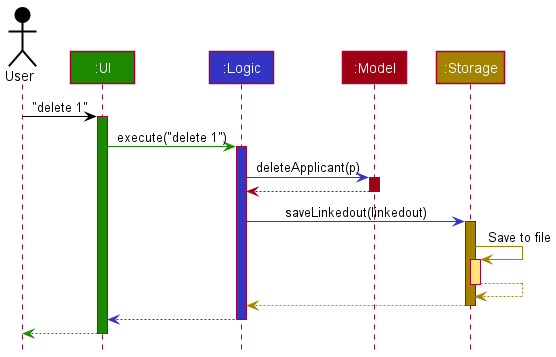

Each of the four main components (also shown in the diagram above),

* defines its *API* in an `interface` with the same name as the Component.
* implements its functionality using a concrete `{Component Name}Manager` class (which follows the corresponding API `interface` mentioned in the previous point.

For example, the `Logic` component defines its *API* in the `Logic.java` interface and implements its functionality using the `LogicManager.java` class which follows the `Logic` interface. Other components interact with a given component through its interface rather than the concrete class (reason: to prevent outside component's being coupled to the implementation of a component), as illustrated in the (partial) class diagram below.


The sections below give more details of each component.

[Back to top ](#table-of-contents)

---
### UI component

The **API** of this component is specified in [`Ui.java`](https://github.com/AY2122S2-CS2103T-T09-2/tp/blob/master/src/main/java/seedu/linkedout/ui/Ui.java)

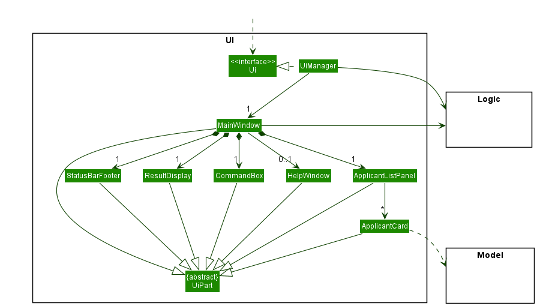

The UI consists of a `MainWindow` that is made up of parts e.g.`CommandBox`, `ResultDisplay`, `ApplicantListPanel`, `StatusBarFooter` etc. All these, including the `MainWindow`, inherit from the abstract `UiPart` class which captures the commonalities between classes that represent parts of the visible *GUI*.

The `UI` component uses the JavaFx UI framework. The layout of these UI parts are defined in matching `.fxml` files that are in the `src/main/resources/view` folder. For example, the layout of the [`MainWindow`](https://github.com/se-edu/linkedout-level3/tree/master/src/main/java/seedu/address/ui/MainWindow.java) is specified in [`MainWindow.fxml`](https://github.com/se-edu/linkedout-level3/tree/master/src/main/resources/view/MainWindow.fxml)

The `UI` component,

* executes user commands using the `Logic` component.
* listens for changes to `Model` data so that the UI can be updated with the modified data.
* keeps a reference to the `Logic` component, because the `UI` relies on the `Logic` to execute commands.
* depends on some classes in the `Model` component, as it displays `Applicant` object residing in the `Model`.

### Logic component

**API** : [`Logic.java`](https://github.com/AY2122S2-CS2103T-T09-2/tp/blob/master/src/main/java/seedu/linkedout/logic/Logic.java)

Here's a (partial) class diagram of the `Logic` component:

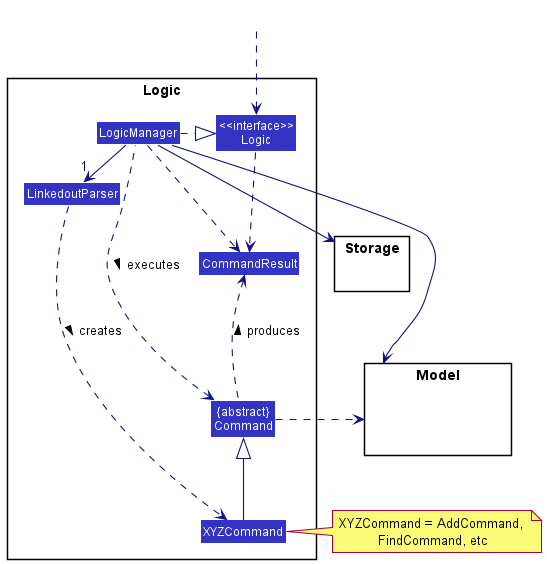

How the `Logic` component works:
1. When `Logic` is called upon to execute a command, it uses the `LinkedoutParser` class to parse the user command.
1. This results in a `Command` object (more precisely, an object of one of its subclasses e.g., `AddCommand`) which is executed by the `LogicManager`.
1. The command can communicate with the `Model` when it is executed (e.g. to add an applicant).
1. The result of the command execution is encapsulated as a `CommandResult` object which is returned back from `Logic`.

The Sequence Diagram below illustrates the interactions within the `Logic` component for the `execute("delete 1")` *API* call.


<div markdown="span" class="alert alert-info">:information_source: **Note:** The lifeline for `DeleteCommandParser` should end at the destroy marker (X) but due to a limitation of PlantUML, the lifeline reaches the end of diagram.
This limitation extends to the rest of our diagrams which are of the same type.
</div>

Here are the other classes in `Logic` (omitted from the class diagram above) that are used for parsing a user command:

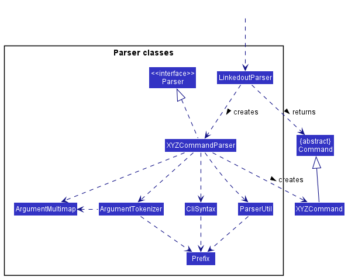

How the parsing works:
* When called upon to parse a user command, the `LinkedoutParser` class creates an `XYZCommandParser` (`XYZ` is a placeholder for the specific command name e.g., `AddCommandParser`) which uses the other classes shown above to parse the user command and create a `XYZCommand` object (e.g., `AddCommand`) which the `LinkedoutParser` returns back as a `Command` object.
* All `XYZCommandParser` classes (e.g., `AddCommandParser`, `DeleteCommandParser`, ...) inherit from the `Parser` interface so that they can be treated similarly where possible e.g, during testing.

[Back to top ](#table-of-contents)

---
### Model component
**API** : [`Model.java`](https://github.com/AY2122S2-CS2103T-T09-2/tp/blob/master/src/main/java/seedu/linkedout/model/Model.java)

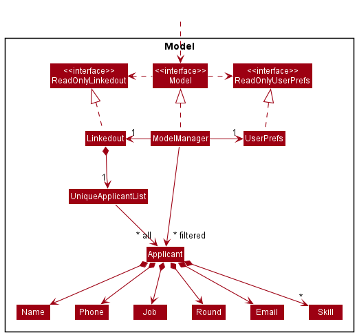


The `Model` component,

* stores the LinkedOUT application data i.e., all `Applicant` objects (which are contained in a `UniqueApplicantList` object).
* stores the currently 'selected' `Applicant` objects (e.g., results of a search query) as a separate _filtered_ list which is exposed to outsiders as an unmodifiable `ObservableList<Applicant>`. This _filtered_ list is then wrapped around a `SortedList` to create a _filtered_, _sorted_ list that can be 'observed' e.g. the UI can be bound to this list so that the UI automatically updates when the data in the list changes or is sorted.
* stores a `UserPref` object that represents the user’s preferences. This is exposed to the outside as a `ReadOnlyUserPref` objects.
* does not depend on any of the other three components (as the `Model` represents data entities of the domain, they should make sense on their own without depending on other components)

[Back to top ](#table-of-contents)

---
### Storage component

**API** : [`Storage.java`](https://github.com/AY2122S2-CS2103T-T09-2/tp/blob/master/src/main/java/seedu/linkedout/storage/Storage.java)

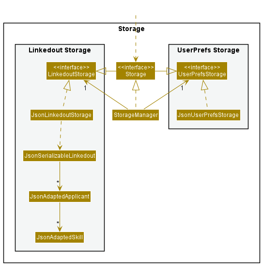

The `Storage` component,
* can save both LinkedOUT application data and user preference data in json format, and read them back into corresponding objects.
* inherits from both `LinkedoutStorage` and `UserPrefStorage`, which means it can be treated as either one (if only the functionality of only one is needed).
* depends on some classes in the `Model` component (because the `Storage` component's job is to save/retrieve objects that belong to the `Model`)

[Back to top ](#table-of-contents)

---
### Common classes

Classes used by multiple components are in the `seedu.linkedout.commons` package.

[Back to top ](#table-of-contents)

--------------------------------------------------------------------------------------------------------------------

## **Implementation**

This section describes some noteworthy details on how certain features are implemented.

### Add applicant feature

**Rationale**

The add command allows the user to add a new applicant to the LinkedOUT list.

**Implementation**

The add command is facilitated by creating an `AddCommand`. `AddCommand` extends `Command` and implements the `Command#execute()` method.

The following activity diagram shows the workflow for the add operation:

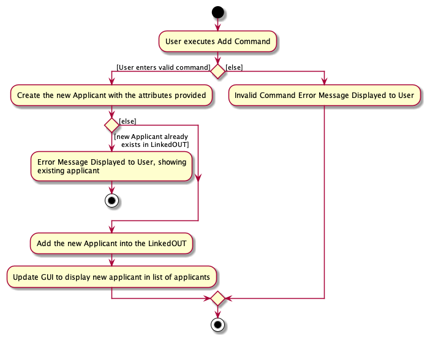

<div markdown="span" class="alert alert-info">:information_source:
 **Note:** There should only be one arrowhead at the end of every line
in the Activity Diagram. This is a known limitation of PlantUML. This limitation extends to the rest of our diagrams which are of the same type.
</div>

Given below is an example usage scenario of how an applicant is added, and how the operation is handled by LinkedOUT:

1. The user enters a valid add command, for example: `add n/Bob p/99991111 e/bob@mail.com j/Data Analyst r/Interview s/Python`. For each command
`LogicManager#execute()` is invoked, which calls `LinkedoutParser#parseCommand()` to separate the command word `add` and the argument
`n/Bob p/99991111 e/bob@mail.com j/Data Analyst r/Interview s/Python`


2. Upon identifying the add command, `AddCommandParser` is instantiated and uses `AddCommandParser#parse()` to
map the various prefixes to the attributes: (e.g `n/` to `Bob`, `p/` to `99991111`)


3. `AddCommandParser#arePrefixesPresent()` is called to ensure all the mandatory prefixes have been inputted by the user. After which
`AddCommandParser#parse()` creates the new `Applicant`


4. `AddCommandParser#parse()` then initializes an `AddCommand` with the new `Applicant` as an argument. `AddCommand#execute()`
is then called, which calls `Model#hasApplicant()` to ensure that the new `Applicant` is not a duplicate of any existing applicant in the
LinkedOUT. upon completion of the check, `Model#addApplicant()` to add the new applicant in LinkedOUT.


5. The command is complete and a `CommandResult` containing the details of the new applicant as a String is returned to
the user.

The following sequence diagram shows how the add operation works:

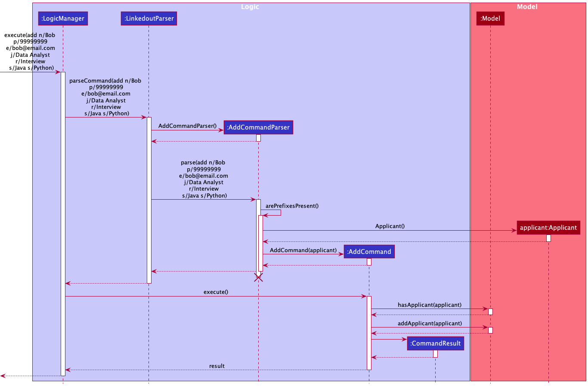

**Design considerations**

**Aspect: How add executes:**

* **Alternative 1 :** Check whether specified applicant already exists before creating an Applicant object.
    * Pros: Avoid creation of unnecessary objects
    * Cons: May cause reduced performance

[Back to top ](#table-of-contents)

---

### Add Skill feature

**Rationale**

The addskill command allows users to add skills to a specific applicant. This command was designed to accommodate edit's functionality when editing skills. To remove skills from an applicant, one can choose to use edit instead.

The reasoning for only including an addskill functionality is that most applicants would pick up new skills, but not lose knowledge of pre-existing ones.

**Implementation**

The addskill mechanism is facililated by `AddSkillCommandParser`. 
`AddSkillCommandParser` parses the inputs using `AddSkillCommandParser#parseSkillsForEdit()` and returns a new set of skills to `AddSkillCommand`.

`AddSkillCommand` then searches for the applicant within the applicant list, and appends the skills to the pre-existing set.

As the skills being passed are checked in `AddSkillCommandParser` and `Skill` upon instantiation, skills parsed can contain a mix of symbols and alphanumeric. They must also be made up of 1 to 5 words.

The following activity diagram shows the workflow for the addskill operation:

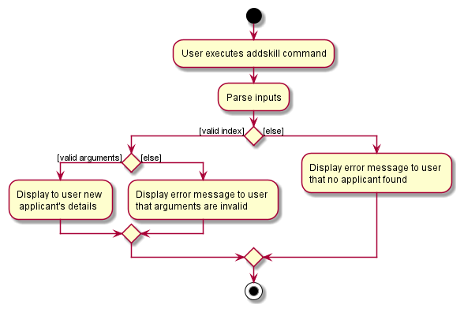

Given below is an example usage scenario of how an applicant is edited.

1. The user enters the addskill command with the specific index and skills to add, `addskill 1 s/C++ s/Vue`.


2. `LinkedoutParser` is invoked to handle the command `addskill` through `LinkedoutParser#parseCommand()`.


3. It then calls upon `AddSkillCommandParser#parse()` to check if the input is empty.


4. If input is not empty, it passes the input to `AddSkillCommandParser#parseSkillsForEdit()` to create a new set, representing the skills to be added.


5. The result is then used to instantiate `AddSkillCommand`. `AddSkillCommand` then finds the applicant at the specified index.


6. With `AddSkillCommand#createEditedApplicant()`, the applicant's pre-existing skills are appended with the new set, and the applicant is added to the model.


7. It then calls upon `CommandResult` to display the final result on the *GUI*.

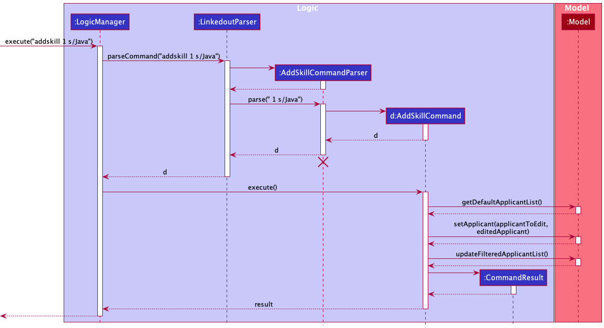

**Design considerations**

**Aspect: How addskill executes:**

* **Alternative 1 (current choice):** Creates a new applicant replace old information.
    * Pros: Easy to implement.
    * Cons: May have performance issues in terms of memory usage.

* **Alternative 2:** Change edit command functionality to allow it to add, delete, clear and replace skills.
    * Pros: One lesser command needed.
    * Cons: Adds extra complexity in code as well as for the user.

---

### Edit applicant feature

**Rationale**

The edit command allows users to change the applicant's details.

**Implementation**

The proposed edit mechanism is facilitated by `EditApplicantDescriptor`. `EditApplicantDescriptor` stores the details of the applicant to change.

The user need to specify an `Index` to select the applicant to edit. `editCommand` extends `Command` and implements the `Command#execute()` method.

The following activity diagram shows the workflow for the edit operation:

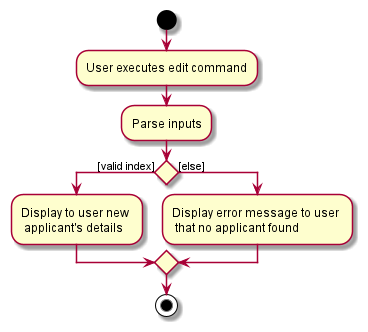

Given below is an example usage scenario of how an applicant is edited.

1. The user enters the edit command with the specific fields to edit, `edit 1 n/Alex Tan`.


2. LinkedOUT updates the applicant with the edited information.

The following sequence diagram shows how the edit operation works:

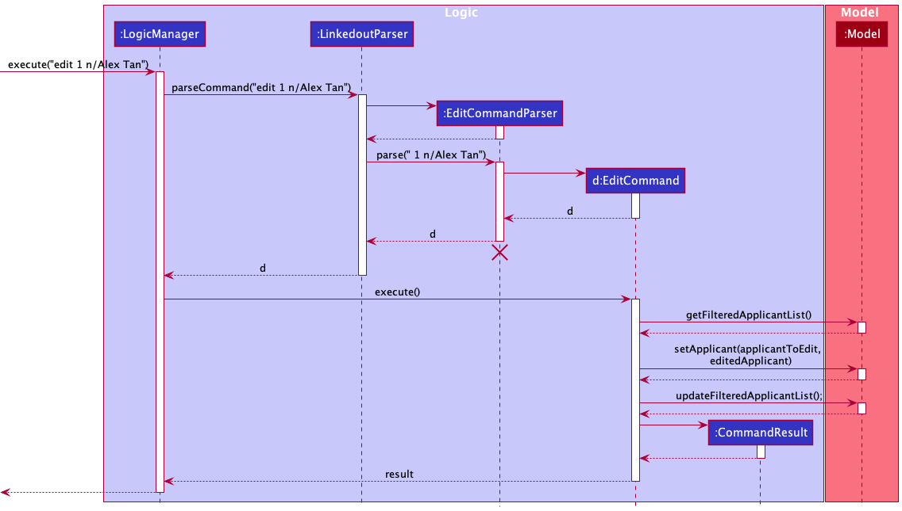

**Design considerations**

**Aspect: How edit executes:**

* **Alternative 1 (current choice):** Creates a new applicant replace old information.
    * Pros: Easy to implement.
    * Cons: May have performance issues in terms of memory usage.

* **Alternative 2:** Replace individual fields inside original applicant.
    * Pros: Will use less memory (Do not have to create an extra applicant).
    * Cons: We must ensure that the implementation of each individual command to change an information is correct.

[Back to top ](#table-of-contents)

---
### View applicant feature

**Rationale**

The view command searches a **single** applicant in LinkedOUT and returns the applicant's details.
It is used when users wish to find a specific applicant they have in mind.
It takes in a single case-insensitive parameter, which is the applicant's full name. No prefix is required.

**Implementation**

The view command is facilitated by `NameContainsAllKeywordsPredicate` which helps the parser match the input.

The user needs to specify a `Name` to allow the application to match and select the applicant. `ViewCommand` extends `Command` and implements the `Command#execute()` method.

As `ViewCommandParser` uses `NameContainsAllKeywordsPredicate`, the `Name` being passed will not match if it contains additional whitespace, but will match inputs which are case-insensitive.

The following activity diagram shows the workflow for the view operation:

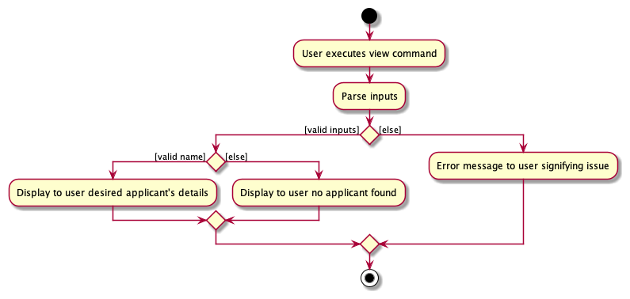

Given below is an example usage scenario of how to view a specific applicant.

1. The user enters the view command with the specific name, `view Alex Tan`.


2. `LinkedoutParser` is invoked to handle the command `view` through `LinkedoutParser#parseCommand()`.


3. It then calls upon `ViewCommandParser#parse()` to check if the input is empty.


4. If input is not empty, it passes the input to `NameContainsAllKeywordsPredicate()`.


5. The result is then initialized as a predicate in `ViewCommand`. `ViewCommand#execute()` then tries to find a match.


6. It then calls upon `CommandResult` to display the final result on the *GUI*.

The following sequence diagram shows how the view operation works:

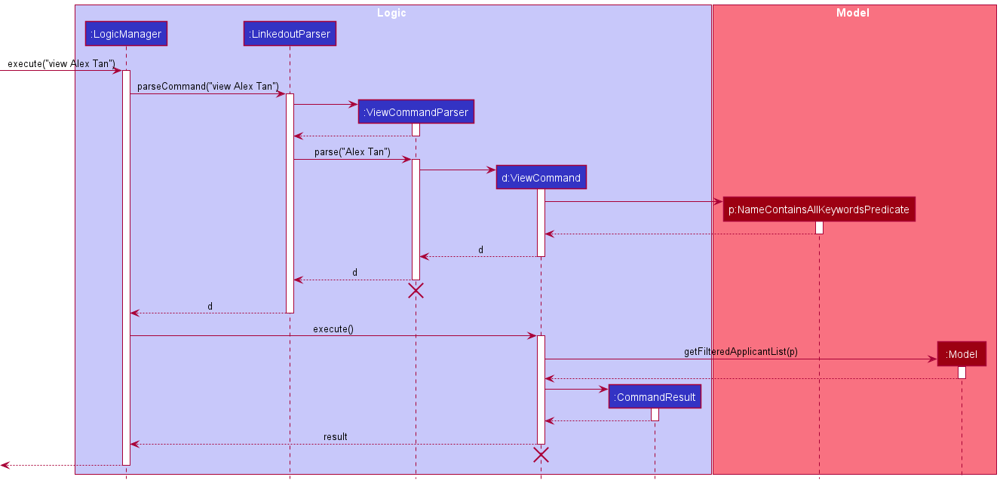

**Design considerations**

**Aspect: How view executes:**

* **Alternative 1 (current choice):** Shows a single applicant.
    * Pros: Easy to implement.
    * Pros: Result is specific.
    * Cons: Strict matching.
    * Cons: Have to remember applicant's name and type it fully.

* **Alternative 2:** Shows multiple applicants based on partial matches.
    * Pros: Less strict matching.
    * Cons: Users are unable to single out a certain applicant.

Weighing the pros and cons of these alternatives, we have decided to abstract alternative 2 as a different feature under `search`.
This is to allow our target user to have greater flexibility, and we believe both are important features to be implemented.

[Back to top ](#table-of-contents)

---
### Search applicant feature

**Rationale**

The search command searches for applicant(s) in LinkedOUT and returns the applicant(s)' details.
It is used when users wish to search for applicant(s) they have in mind.
It takes in prefix(es) with case-insensitive parameter, which can be applicant's name, job, round and skill.

**Implementation**

The proposed search mechanism is facilitated by `SearchCommandParser`. `SearchCommandParser` will map the creation of `KeywordsPredicate` based on the input prefix. `KeywordsPredicate` supports the following implementation:
* `NameContainsKeywordsPredicate` — Predicate which returns true if an applicant's full name matches partially with the exact input attribute.
* `JobContainsKeywordsPredicate` — Predicate which returns true if an applicant's job name matches partially with the exact input attribute.
* `RoundContainsKeywordsPredicate` — Predicate which returns true if an applicant's round matches partially with the exact input attribute.
* `ApplicantContainsSkillKeywordsPredicate` — Predicate which returns true if an applicant's skill matches partially with the exact input attribute.

These predicates assist the filtering of applicant list in the `Model` interface, specifically for  `Model#updateSearchApplicantList()` and `Model#getDefaultApplicantList()`.

The following activity diagram shows the workflow of the search command:

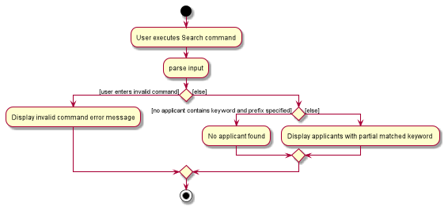

Given below is an example usage scenario and how the search mechanism behaves at each step.

Example 1
1. The user enters search command with prefix and specified attribute, `search n/David Lee`.


2. The input attributes will be passed into `SearchCommandParser` and creates a `NameContainsKeywordsPredicate` if the attribute
   and prefix are not empty.


3. The predicate is then passed into `Model#updateSearchApplicantList()` to filter and display applicants with partial name
   matching of `David` or `Lee` in LinkedOUT.


Example 2
1. The user enters `search j/Software n/David` command to search for applicants in LinkedOUT.


2. The input attributes will be passed into `SearchCommandParser` and creates a `JobContainsKeywordsPredicate` and `NameContainsKeywordsPredicate` if the attributes are not empty.


3. The predicate is then passed into `Model#updateSearchApplicantList()` to filter and sort the applicants with partial job and name matching of `Software` or `David`. Applicant with the most matched attributes will be displayed on the top of LinkedOUT.

The following sequence diagram shows how the search operation works:

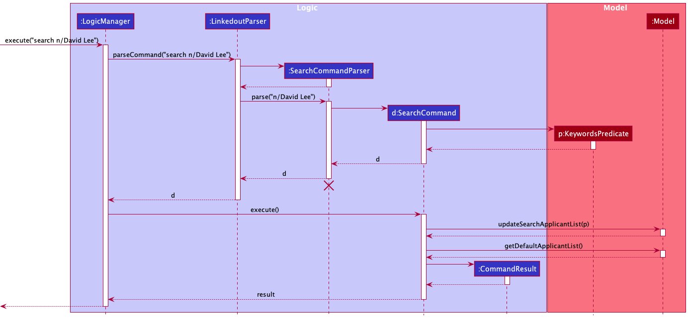

**Design considerations**:

**Aspect: How search executes:**

* **Alternative 1 (current choice):** Uses prefixes to search for applicants with combination of matching attributes.
    * Pros: Able to search an applicant using combination of different fields/prefixes. Provides a more precise and broader search.
    * Cons: Hard to implement.

* **Alternative 2:** Only search for an applicant using partial matching name.
    * Pros: Easy to implement.
    * Cons: Inflexible use of search command.

[Back to top ](#table-of-contents)

---

### Sort applicant feature

**Rationale**

The sort command shows the list of applicants **temporarily** sorted by either `NAME` or `JOB` and in ascending or descending order.

**Implementation**

The proposed sort mechanism is facilitated by `SortCommandParser`. 
`SortCommandParser` will map the creation of `SortComparator` based on the input prefix and returns a `SortCommand` with
the `SortComparator`.

`SortCommand` extends `Command` and implements the `Command#execute()` method.

The following activity diagram shows the workflow of the search command:

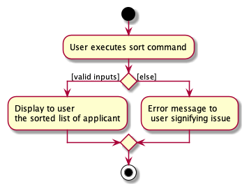

Given below is an example usage scenario and how the search mechanism behaves at each step.

1. The user enters the sort command with the specific field to sort by and sorting order,
   `sort f/name o/asc`.
   
2. The input fields will be passed into `SortCommandParser` and creates a `SortComparator` 
   if the field and order are not empty.
   
3. The `SortComparator` is then passed into `Model#updateDefaultApplicantList()` to sort and display
   the list of sorted applicants in LinkedOUT.

The following sequence diagram shows how the sort operation works:

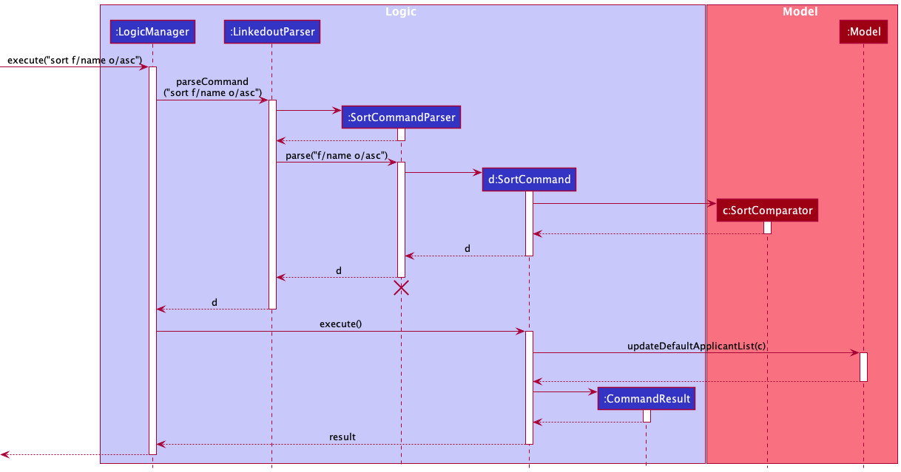

**Design considerations**:

**Aspect: How sort executes:**

* **Alternative 1 (current choice):** Displays a temporary sorted list
    * Pros: Original order of list retained.
    * Cons: Unable to sort list permanently.

* **Alternative 2:** Sort list permanently.
    * Pros: List can be permanently sorted.
    * Cons: Original order in list is lost.
  
[Back to top ](#table-of-contents)

---

### Flag applicant feature

**Rationale**

The flag feature and it's associated `flag` command allows the user to flag an existing applicant in the LinkedOUT list, pinning them to the top for easy reference.

**Implementation**
The flag mechanism is facilitated by the `FlagCommandParser`. `FlagCommandParser` parses the user inputs using `FlagCommandParser#parse()` to obtain the index of the applicant to be flagged.

`FlagCommand` then searches for the applicant in the applicant list, and toggles it's flagged status.

The following activity diagram shows the workflow for the flag operation:

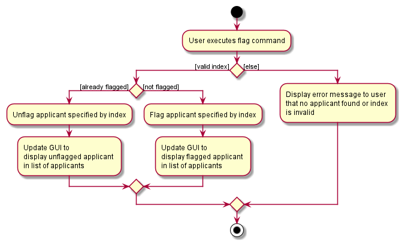

Given below is an example usage scenario of how an applicant is flagged, and how the operation is handled by LinkedOUT:

1. The user enters a valid flag command, for example: `flag 1`. For each command `LogicManager#execute()` is invoked, which calls `LinkedoutParser#parseCommand()` to separate the command word `flag` and the argument `1`.

2. Upon identifying the flag command, `FlagCommandParser` is instantiated and uses `FlagCommandParser#parse()` to obtain the index of the applicant to be flagged.

3. `ParserUtil#parseIndex(args)` is then called by `FlagCommandParser#parse()` to obtain the index of the applicant to be flagged as an argument to be passed around internal components, as well as to check the validity of the index provided.   

4. `FlagCommandParser#parse()` then initializes a `FlagCommand` with the obtained index as the argument.
   
5. The logic manager calls `FlagCommand#execute()` which obtains the applicant at the specified index.
    
6. With `FlagCommand#createFlaggedApplicant()`, the applicant obtained is cloned, but it's flagged status is toggled, and the initial applicant obtained is replaced by its cloned version.

7. A call to `CommandResult` then displays the final result on the GUI.

The following sequence diagram shows how the flag operation works:

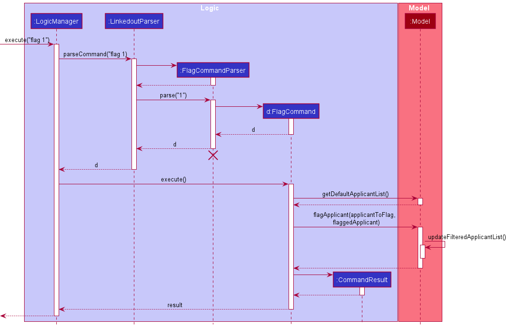

**Design considerations**

Aspect: How flag executes :
* Alternative 1 (current choice): Create a new applicant with toggled flag status to replace the specified applicant.
  * Pros: Immutability, easier to debug, and less side effects.
  * Cons: More memory usage, more verbose to implement.
* Alternative 2: Change the state of the applicant directly, by making the flag status mutable.
  * Pros: Less verbose to implement.
  * Cons: Change of applicant state makes debugging the application harder, and contains possibility of introducing side effects.

[Back to top ](#table-of-contents)

--------------------------------------------------------------------------------------------------------------------

## **Documentation, logging, testing, configuration, dev-ops**

* [Documentation guide](Documentation.md)
* [Testing guide](Testing.md)
* [Logging guide](Logging.md)
* [Configuration guide](Configuration.md)
* [DevOps guide](DevOps.md)
  
[Back to top ](#table-of-contents)

--------------------------------------------------------------------------------------------------------------------

## **Appendix: Requirements**

### Product scope

**Target user profile**:

* is a recruiter looking to hire for multiple jobs in a tech firm
* is reasonably comfortable using *CLI* apps
* Work pattern : works alone and does not share his/her computer
* Job scope : Many applications to sieve through on a daily basis
* Interaction level : Interacts with the applicants


**Value proposition**: Simple and easy-to-use tool for recruiter to LinkedOUT to applicants and manage the applicant's information efficiently.

[Back to top ](#table-of-contents)

---
### User stories

Priorities: High (must have) - `* * *`, Medium (nice to have) - `* *`, Low (unlikely to have) - `*`

| Priority | As a …​                                           | I want to …​                                                                                                       | So that I can…​                                                   |
|----------|---------------------------------------------------|--------------------------------------------------------------------------------------------------------------------|-------------------------------------------------------------------|
| `* * *`  | Recruiter (new user)                              | add an applicant's name, contact details and job applied                                                           | track all the applicant for the job                               |
| `* * *`  | Recruiter (new user)                              | view an individual applicant                                                                                       | see the details of a particular applicant                         |
| `* * *`  | Recruiter (new user)                              | view the list of all applicants                                                                                    | have an overview of all applicants                                |
| `* * *`  | Recruiter (new user)                              | delete an applicant                                                                                                | remove an applicant when he is rejected/withdraws application     |
| `* * *`  | Recruiter                                         | edit applicant's info                                                                                              | update their applicantal particulars                                 |
| `* * *`  | Recruiter                                         | add the applicant’s number of years of work experience in the related field                                        | make hiring decisions                                             |
| `* * *`  | Recruiter                                         | add the job that the applicant applied to                                                                          | know which applicant is interested in which job.                  |
| `* * *`  | Recruiter                                         | add the applicant’s highest education level                                                                        | I can make hiring decisions.                                      |
| `* * *`  | Recruiter                                         | undo my latest actions                                                                                             | Rectify any mistakes made                                         |
| `* * *`  | Busy recruiter                                    | search an applicant in the system by name.                                                                         |                                                                   |
| `* * *`  | Familiar user and recruiter                       | to be able to see the list of applicants with their contact, applied job and their respective rounds of interview. |                                                                   |
| `* * *`  | Recruiter that deals with large amounts of data   | get rid of unwanted data                                                                                           | I don’t get confused by them.                                     |
| `* *`    | Recruiter(New user)                               | view a useful user guide                                                                                           | I know how to use the application properly                        |
| `* *`    | Recruiter                                         | view a summary of any applicants skill set                                                                         | I do not have to keep referencing their resume                    |
| `* *`    | Busy recruiter                                    | see what round of the job application a particular applicant is at                                                 | I can keep track of their progress                                |
| `* *`    | Recruiter with heavy workload                     | see a list of job vacancies I’m looking to fill                                                                    | see a list of job vacancies I’m looking to fill                   |
| `* *`    | Familiar user and busy recruiter                  | I want to be able to filter applicants by skill                                                                    | see who has the relevant skills                                   |
| `* *`    | Familiar user and busy recruiter                  | want to be able to filter an applicant by number of years of work experience                                       | view who fits my job needs                                        |
| `* *`    | Familiar user and busy recruiter                  | to be able to filter the applicants by job applied                                                                 | view who is interviewing for the job and what rounds they are at. |
| `* *`    | As a long time user                               | to archive data                                                                                                    | can reference it if needed in the future                          |
| `* *`    | Experienced recruiter                             | label applicants based on priority/ urgency                                                                        | I can tend to those applicants first                              |
| `* *`    | Frequent user                                     | I want the app to filter out errors in the user’s data                                                             | I don’t have to look for errors                                   |
| `* *`    | Recruiter                                         | check if there are duplicated data of an applicant                                                                 | check on the total number of applicants accurately                |
| `* *`    | Efficient recruiter                               | import from files                                                                                                  | not have to key in everything manually                            |
| `* *`    | Experienced recruiter                             | have shortcuts                                                                                                     | not have to type in the same commands                             |
| `* *`    | Recruiter who uses on a daily basis               | save the most used command                                                                                         | my work is more streamlined                                       |
| `*`      | Experienced recruiter                             | flag an applicant                                                                                                  | quickly refer to their info in the future                         |
| `*`      | Recruiter for a large firm                        | I want to export the data                                                                                          | pass it to another department/hiring manager if needed.           |
| `*`      | Lazy recruiter                                    | automate commands                                                                                                  | do everything in one click                                        |
| `*`      | Efficient recruiter                               | work on the app smoothly                                                                                           | handle large amount of tasks at one time                          |

[Back to top ](#table-of-contents)

---
### Use cases

(For all use cases below, the System is LinkedOUT, and the Actor is the user unless specified otherwise)

---
**Use case 1: Add an applicant**

**Preconditions: LinkedOUT application is launched.**

**Guarantees: Applicant will be added only if the user input
does not have any formatting issues.**

**MSS**

1. User requests to add a new applicant.
2. LinkedOUT shows the updated list of applicants.

    Use case ends.

**Extensions**

* 1a. User provides an invalid input to add an applicant. 

    * 1a1. LinkedOUT shows an error message. 
        
      Use case resumes at step 1.
    
* 1b. User adds a duplicate applicant.

    * 1b1. LinkedOUT does not add the applicant and shows an error message to the user.
      
      Use case resumes at step 1.

[Back to top ](#table-of-contents)

---
    
**Use case 2: View an individual applicant**

**Preconditions: LinkedOUT application is launched.**

**Guarantees: Applicant will be displayed only if the user input
does not have any formatting issues.**

**MSS**

1. User requests to view an individual applicant.
2. LinkedOUT shows the individual applicant.

    Use case ends.

**Extensions**

* 1a. Applicant does not exist.
  
    * 1a1. LinkedOUT shows 0 applicants listed.
      
      Use case resumes at step 1.
    
* 1b. User provides an invalid input to view applicant.

    * 1b1. LinkedOUT shows an error message.
        
      Use case resumes at step 1.
    
[Back to top ](#table-of-contents)

---
**Use case 3: Search for applicant(s)**

**Preconditions: LinkedOUT application is launched.**

**Guarantees: Applicant(s) will be displayed only if the user input
does not have any formatting issues.**

**MSS**

1. User requests to search for applicant(s) with a specific skill and job.
2. LinkedOUT shows the list of applicant(s) with the skill or job, in descending order of matched attribute.

   Use case ends.

**Extensions**

* 1a. Applicant does not exist

    * 1a1. LinkedOUT shows 0 applicant listed.

      Use case resumes at step 1.

* 1b. User provides an invalid input to search for applicant(s).

    * 1b1. LinkedOUT shows an error message

      Use case resumes at step 1.

[Back to top ](#table-of-contents)

---
    
**Use case 4: View list of all applicants**

**Preconditions: LinkedOUT application is launched.**

**Guarantees: List of applicants will be displayed.**

**MSS**

1.  User requests to list applicants.
2.  LinkedOUT shows a list of applicants.

    Use case ends.

**Extensions**

* 2a. The list is empty.

  Use case ends.

[Back to top ](#table-of-contents)

---
**Use case 5: Delete an applicant**

**Preconditions: LinkedOUT application is launched.**

**Guarantees: Applicant will be deleted only if the user input
does not have any formatting issues.**

**MSS**

1.  User requests to list applicants.
2.  LinkedOUT shows a list of applicants.
3.  User requests to delete a specific applicant in the list.
4.  LinkedOUT deletes the applicant.

    Use case ends.

**Extensions**

* 2a. The list is empty.

  Use case ends.

* 3a. The given index is invalid.

    * 3a1. LinkedOUT shows an error message.

      Use case resumes at step 2.

[Back to top ](#table-of-contents)

---

**Use case 6: Edit an applicant**

**Preconditions: LinkedOUT application is launched.**

**Guarantees: Applicant will be edited only if the user input
does not have any formatting issues.**

**MSS**

1.  User requests to list applicants.
2.  LinkedOUT shows a list of applicants.
3.  User requests to edit a specific applicant in the list.
4.  LinkedOUT edits the applicant.

    Use case ends.

**Extensions**

* 2a. The list is empty.

  Use case ends.

* 3a. The given index is invalid.

    * 3a1. LinkedOUT shows an error message.

      Use case resumes at step 2.
    
[Back to top ](#table-of-contents)

---

**Use case 7: Sort the list of applicants**

**Preconditions: LinkedOUT application is launched**

**Guarantees: A temporarily sorted list of applicants will be displayed
only if the user input does not have any formatting issues.**

**MSS**

1.  User requests to list applicants.
2.  LinkedOUT shows a list of applicants.
3.  User requests to sort the list of applicants.
4.  LinkedOUT shows the list of applicants in a sorted order.

    Use case ends.

**Extensions**

* 2a. The list is empty.

  Use case ends.

* 3a. User provides an invalid input to sort the list of applicants.

    * 3a1. LinkedOUT shows an error message.

      Use case resumes at step 3.

[Back to top ](#table-of-contents)

---


**Use case 8: Add skills to an applicant**

**Preconditions: LinkedOUT application is launched. There is at least one applicant in the list.**

**Guarantees: Skills will be added to an applicant only if the user input
does not have any formatting issues.**

**MSS**

1.  User requests to list applicants.
2.  LinkedOUT shows a list of applicants.
3.  User enters the skill(s) to be added to the applicant.
4.  LinkedOUT shows the updated applicant.

   Use case ends.

**Extensions**

* 2a. The list is empty.

    Use case ends.

* 3a. User inputs invalid skill(s) or index.

    * 3a1. LinkedOUT shows an error message

      Use case resumes at step 3.

[Back to top ](#table-of-contents)

---

**Use case 9: Flag an applicant**

**MSS**

1. User requests to flag an applicant
2. LinkedOUT shows the updated list of applicants

   Use case ends.

**Extensions**

* 1a. User inputs invalid applicant index

    * 1a1. LinkedOUT shows an error message

      Use case resumes at step 1.
      
[Back to top ](#table-of-contents)

---

**Use case 10: Unflag an applicant**

**MSS**

1. User requests to unflag an applicant
2. LinkedOUT shows the updated list of applicants

   Use case ends.

**Extensions**

* 1a. User inputs invalid applicant index

    * 1a1. LinkedOUT shows an error message

      Use case resumes at step 1.
      
[Back to top ](#table-of-contents)

---

**Use case 11: Clear all applicants**

**MSS**

1. User requests to clear all applicants from the list
2. LinkedOUT clears the list of all applicants.

---
### Non-Functional Requirements

1.  Technical: The application should work on any _mainstream OS_ as long as it has Java `11` or above installed.
2.  Performance: The application should be able to hold up to 1000 applicants without a noticeable sluggishness in performance for typical usage.
3.  Performance: The system should take at most 2 seconds to return an output.
4.  Disaster Recovery: In case of system failure, the application should still contain data saved up to the last command executed.
5.  Persistency: The system should save after a command to ensure no data loss.
6.  Testing: There should be at least one test case for each major component.
7.  Fault Tolerance: The system should not crash due to an invalid input but instead show an error message.
8.  Portability: The application should run on an imported _JSON_ file as long as it adheres to the format used when saving to files.
9.  Efficiency: A user with above average typing speed for regular English text (i.e. not code, not system admin commands) should be able to accomplish most of the tasks faster using commands than using the mouse.
10. Usability: The user interface should be clean and intuitive for users who have basic IT knowledge.
11. Process: The project is expected to adhere to a schedule based off our milestones from the different versions ranging from v1.1 to v1.4.
12. Documentation: User Guide should be able to be understood by readers who have basic IT knowledge.

*{More to be added}*

[Back to top ](#table-of-contents)

---
### Glossary

* **Mainstream OS**: Windows, Linux, Unix, OS-X
* **API**: Application Programming Interface: Refers to a software acting as an intermediary allowing two applications
  to communicate with each other.
* **JSON**: JavaScript Object Notation: An open standard file format which we use to read and write data from.
* **GUI**: Graphical User Interface: Refers to the user interface that the user interacts with.
* **CLI**: Command Line Interface: Refers to a computer program that accepts text inputs.

[Back to top ](#table-of-contents)

--------------------------------------------------------------------------------------------------------------------

## **Appendix: Instructions for manual testing**

Given below are instructions to test the app manually.

<div markdown="span" class="alert alert-info">:information_source: **Note:** These instructions only provide a starting point for testers to work on;
testers are expected to do more *exploratory* testing.

</div>

---
### Launch and shutdown

1. Initial launch.

   1. Download the jar file and copy into an empty folder.

   2. **For Windows:** Double-click the file to start the app.<br>
     
      **For Mac:** Open up a [terminal](#https://www.maketecheasier.com/launch-terminal-current-folder-mac/) in the current folder which contains the LinkedOUT jar file<br>
      Then, run the following command: 
      ```java -jar LinkedOUT.jar```
   
      Expected: Shows the GUI with a set of sample applicants. The window size may not be optimum.

1. Saving window preferences.

   1. Resize the window to an optimum size. Move the window to a different location. Close the window.

   1. Re-launch the app by double-clicking the jar file.<br>
       Expected: The most recent window size and location is retained.
       
[Back to top ](#table-of-contents)

---

### Adding an applicant

<div markdown="block" class="alert alert-info">

**:information_source: Code blocks for the *Adding an applicant* section:**
The commands in code blocks for this section are meant to be inputted in one line.
</div>

1. Adding an applicant while all applicants are being shown in the *GUI*.

    1. Prerequisites: List all applicants using the `list` command. Multiple applicants in the list. No other applicant named Alice in the list.
       Bob is an applicant in the list.

    2. Test case: 
       ```
       add 
       n/Alice 
       p/99990000 
       e/alice@mail.com 
       j/Software Engineer
       r/Technical Interview
       s/Java
       ```
       Expected: An applicant named Alice with the above attributes will be added to the applicant list and displayed on the *GUI*.

    3. Test case:
       ```
       add
       n/Bob
       p/99990000
       e/bob@mail.com
       j/Site Reliability Engineer
       r/Technical Interview
       s/Jira 
       s/SonarQube
       ```
       Expected: No changes occur as an applicant named Bob is already in the list, and duplicate applicants with the same names are not allowed.

    4. Test case:
       ```
       add 
       n/Charles 
       s/Haskell
       ```
       Expected: No changes occur as the phone number, email, job applied to and round of interview are all mandatory attributes
       that are not included in the above add command. These must be specified with the `p/`, `e/`, `j/` and `r/` prefixes respectively.
       
[Back to top ](#table-of-contents)

---

### Add skills to an applicant

1. Adding a skill to an applicant while all applicants are being shown in the *GUI*.

    1. Prerequisites: List all applicants using the `list` command. Multiple applicants in the list.
       Current State: The first applicant has pre-existing skills of `JavaScript` and `TypeScript`.

    1. Test case: `addskill 1 s/Python s/Java`<br>
       Expected: New skills `Python` and `Java` are added to the first applicant's skill list.

    1. Test case: `addskill 1 s/JavaScript`<br>
       Expected: No new skill will be added to first applicant's skill list as it already exists. No error is thrown.

    1. Test case: `addskill 1 s/Javascript`<br>
       Expected: New skill `Javascript` will be added to first applicant's skill list. This is because the skills are case-insensitive,
       hence `Javascript` and `JavaScript` will be treated as two different skills.

    1. Test case: `addskill 0 s/Python s/Java`<br>
       Expected: No skill is added to any applicant. Error details shown in the status message.

    1. Other incorrect delete commands to try: `addskill s/Python`, `addskill 1`, `addskill 1 Python`, `addskill x` (where x is larger than the list size)<br>
       Expected: Similar to previous.

---

### Editing an applicant

1. Editing an applicant while all applicants are being shown in the *GUI*.

    1. Prerequisites: List all applicants using the `list` command. Multiple applicants in the list.
       Current State: The first applicant is Bob, with the following attributes:
       ```         
       Name: Bob
       Phone Number: 99991111
       Email Address: bob@mail.com
       Job Applied: Data Analyst
       Round: Interview 
       Skills: Python
       ```

    2. Test case: `edit 1 n/Charles e/charles@mail.com` <br>
       Expected: The first applicant's name is changed to `Charles` and the email address is changed
       to `charles@mail.com`. All other attributes remain unchanged.

    3. Test case: `edit 1 s/Javascript s/Java` <br>
       Expected: The first applicant's existing skills are removed, and only `Javascript` and `Java`
       will be in their skill list. All other attributes remain unchanged.

    4. Test case: `edit 1 s/` <br>
       Expected: All skills are removed from the first applicant, their skill list will now be empty.
       All other attributes remain unchanged.

    5. Test case: `edit 0 n/Jamie` <br>
       Expected: No changes occur, as 0 is an invalid index. Error details shown in status message

    6. Other incorrect edit commands to try: `edit o/Jamie`, `edit p/Jamie`, `edit x n/Jamie`
       (where x is greater than list size). <br>
       Expected: Similar to previous.

[Back to top ](#table-of-contents)

---

### View an applicant

1. View an applicant while all applicants are being shown in the *GUI*.

    1. Current State: The list has pre-existing applicants. The first applicant has full name of `Bob Tan`.

    2. Test case: `view Bob Tan`<br>
       Expected: Only applicant named `Bob Tan` is displayed in the list.

    3. Test case: `view Tan`<br>
       Expected: No applicant is displayed in the list.

    4. Test case: `view n/Bob Tan`<br>
       Expected: No applicant is displayed in the list. This is because prefix is not needed in view.

    5. Test case: `view BobTan`<br>
       Expected: No applicant is displayed in the list. This is because exact full name with correct spacing is needed to view on an applicant.

    6. Test case: `view bob tan`<br>
       Expected: Only applicant named `Bob Tan` is displayed in the list. This is because full name are case-insensitive.

    7. Other incorrect view commands to try: `view` and `View`<br>
       Expected: No applicant is displayed. Error details shown in the status message.

[Back to top ](#table-of-contents)

---

### Searching for applicant(s)

1. Searching for applicant(s) while all applicants are being shown in the *GUI*.

    1. Current State: The list has pre-existing applicants. The first applicant has name of `Bob Tan` with job in `Software Engineer`.
       The second applicant has name of `Amy Tan` with job in `Software Developer`.

    2. Test case: `search n/Tan`<br>
       Expected: Both applicants are displayed in the list.

    3. Test case: `search n/Bob`<br>
       Expected: Only applicant named `Bob Tan` is displayed in the list.

    4. Test case: `search n/bOb`<br>
       Expected: Only applicant named `Bob Tan` is displayed in the list. This is because search attributes are case-insensitive.

    5. Test case: `search n/Jason`<br>
       Expected: No applicant is displayed in the list.

    6. Test case: `search n/Bo`<br>
       Expected: No applicant is displayed in the list. This is because search attribute has to be an exact word (can be split by spacing).

    7. Test case: `search j/Bob`<br>
       Expected: No applicant is displayed in the list. This is because the search attribute has to match with the correct prefix.

    8. Test case: `search n/Tan j/Engineer`<br>
       Expected: Both applicants are displayed in the list but `Bob Tan` is shown on the top of the list. This is because applicant with the most matching attributes will be displayed first.

    9. Test case: `search n/Amy j/Engineer`<br>
       Expected: Both applicants are displayed in the list and the order of applicant shown is based on the original list. In this case, `Bob Tan` is shown above `Amy Tan`.

    10. Other incorrect search commands to try: `search`, `Search`, `search Bob`, `search w/Bob`, `search n/`<br>
        Expected: No applicant is displayed. Error details shown in the status message.

[Back to top ](#table-of-contents)

---

### Sorting list of applicants

1. Sorting the list of applicants temporarily while all applicants are being shown.

    1. Prerequisites: List all applicants using the `list` command. Multiple applicants in the list.
       If list is empty, sorting will have no result but sorting is still available. 

    2. Test case: `sort f/name o/asc`<br>
       Expected: A temporary sorted list of applicants will show with applicants sorted in ascending alphabetical order with their names.

    3. Test case: `sort f/name o/desc`<br>
       Expected: A temporary sorted list of applicants will show with applicants sorted in descending alphabetical order with their names.
        
    4. Test case: `sort f/job o/asc`<br>
       Expected: A temporary sorted list of applicants will show with applicants sorted in ascending alphabetical order with the job they applied to.
    
    5. Test case: `sort f/email o/asc`<br>
       Expected: A temporary sorted list will not be shown. Error details shown in the status message.
       
    6. Other incorrect delete commands to try: `sort f/skill o/asc`, `sort f/job o/ascending`, `sort name asc`<br>
       Expected: Similar to previous.

[Back to top ](#table-of-contents)

---

### Flagging an applicant

1. Flagging an applicant while all applicants are being shown in the *GUI*.

    1. Prerequisites: List all applicants using the `list` command. Multiple applicants in the list.
       Current state: The first applicant is presumed to be unflagged.

    2. Test case: `flag 1` <br>
       Expected: First applicant is flagged, a flag icon appears to the right of applicant details and flagged applicant is now at the top of the list.

    3. Test case: `flag 1` <br>
       Assumption: Test case above is completed, and the first applicant is now flagged. <br>
       Expected: First applicant is now unflagged, flag icon disappears, and applicant is no longer at the top of the list.

    4. Test case: `flag -1` <br>
       Expected: No applicant is flagged as index is invalid. Error details shown in the status message.

    5. Test case: `flag 999999999999` <br>
       Expected: No applicant is flagged as index is too large to be parsed. Error details shown in the status message.

    6. Other incorrect flag commands to try: `flag`, `flag 1 1`, `flag x`, (where x is larger than the list size) <br>
       Expected: Similar to test case 4.

[Back to top ](#table-of-contents)

---

### Deleting an applicant

1. Deleting an applicant while all applicants are being shown in the *GUI*.

    1. Prerequisites: List all applicants using the `list` command. Multiple applicants in the list.

    2. Test case: `delete 1`<br>
       Expected: First applicant is deleted from the list. Details of the deleted applicant shown in the status message.

    3. Test case: `delete 0`<br>
       Expected: No applicant is deleted. Error details shown in the status message.

    4. Other incorrect delete commands to try: `delete`, `delete 1 1`, `delete x`, (where x is larger than the list size)<br>
       Expected: Similar to previous.

---

### Clearing the application

1. Clearing all applicants from LinkedOUT when multiple applicants are being shown in the *GUI*.

    1. Test case: `clear` followed by clicking `Yes` on the confirmation box. <br>
       Expected: All applicants are deleted from the application, an empty list is seen.

    2. Test case: `clear` followed by clicking `No` on the confirmation box. <br>
       Expected: No changes occur in the application, list of applicants remain unchanged.

    3. Test case: `clear` followed by closing the confirmation box. <br>
       Expected: No changes occur in the application, list of applicants remain unchanged.

    4. Test case: `clear x` (where x can be a Integer or a String). <br>
       Expected: Confirmation box pops up, outcomes similar to test cases i, ii and iii.

[Back to top ](#table-of-contents)

---

### Saving data

1. Saving data
   1. Prerequisites: Permanently modify list of applicants using any commands.
   2. Test case: `delete 1` follow by `exit` command and relaunch the app. <br>
      Expected: First applicant before `delete` command will not be in the list of applicants upon relaunch.
2. Dealing with missing files
   1. Prerequisites: *JSON* file is missing, delete `data/linkedout.json` file to simulate the missing file.
   2. Launch the app. <br>
      Expected: The app starts with a default list of applicants.
3. Dealing with corrupted data files
   1. Prerequisites: *JSON* file is corrupted, modify `data/linkedout.json` file with any software
      that can edit the file and save. 
   2. Launch the app. <br>
      Expected: The app starts with an empty list of applicants.

[Back to top ](#table-of-contents)
