## Table of Contents
* Table of Contents
{:toc}
--------------------------------------------------------------------------------------------------------------------

## Introduction

**What is LinkedOUT?**

LinkedOUT is the only application that any experienced recruiter needs. LinkedOUT allows recruiters to keep track of many applicants, and the job they applied for. You can store their contact details, skills and the round of their application, all in one place.

LinkedOUT helps recruiters manage the multiple job applications they may receive on a daily basis. With many applications, it may be difficult to keep track of each applicant and which application round they are currently at.

Thus, LinkedOUT aims to improve a recruiter's experience. LinkedOUT presents recruiters with the ability to flag important applicants, edit applicants easily and search for them with ease.

LinkedOUT comes with a Command Line Interface ([CLI](#glossary)) as well as a Graphical User Interface ([GUI](#glossary)) in order to provide recruiters a more streamlined experience.

**Who is this User Guide for?**

This user guide is meant for users who wish to learn how to use our application. It is best suited for recruiters who are looking to incorporate this app into their daily workflows.

If you would like to learn more about the technical aspects of our application instead, you can do so by reading our [Developer Guide](https://ay2122s2-cs2103t-t09-2.github.io/tp/DeveloperGuide.html).

[Back to top ](#table-of-contents)

--------------------------------------------------------------------------------------------------------------------
## Legend

<div markdown="block" class="alert alert-info">

**:information_source: Notes:**
Notes are placed in this guide to specify extra details on the command format and serves as a guide to assist you. 
</div>

<div markdown="span" class="alert alert-primary">:bulb: **Tip:**
Tips are placed in this guide to serve as suggestions that you can try out while using our application.
</div>

<div markdown="span" class="alert alert-warning">:exclamation: **Caution:**
Cautions are placed in this guide to serve as warnings for certain actions.
</div>

[Back to top ](#table-of-contents)


--------------------------------------------------------------------------------------------------------------------
## Quick start

1. Ensure you have Java `11` or above installed on your Computer.


2. Download the latest `LinkedOUT.jar` from [here](https://github.com/AY2122S2-CS2103T-T09-2/tp/releases/tag/v1.3(trial)).


3. Copy the file to the folder you want to use as the _home folder_ for LinkedOUT.


4. **For Windows:** Double-click the file to start the app.<br>
   **For Mac:** Open up a [terminal](#https://www.maketecheasier.com/launch-terminal-current-folder-mac/) in the current folder which contains the LinkedOUT jar file <br>
   Then, run the following command: <br>
   ```java -jar LinkedOUT.jar``` 
   
    <br>
   
    LinkedOUT comes with sample data for you to experiment on. Upon starting the application, you should see the following screen:
    
    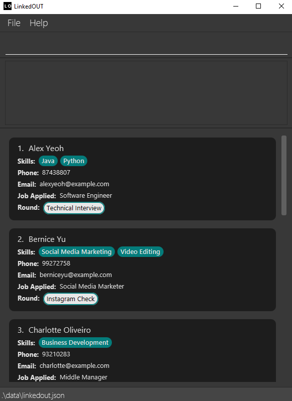


5. Type the command in the command box and press Enter to execute it. e.g. typing **`help`** and pressing Enter will open the help window.<br>
   Some example commands you can try:

    * **`list`** : Lists all job applicants, along with an overview of each applicant.

    * **`add`**`n/Bob p/99999999 e/bob@example.com j/Data Analyst r/Interview s/Pandas` : Adds an applicant named `Bob` to the list of applicants.
    
     * **`delete`**`1` : Deletes the first applicant from the list of applicants.
    
    * **`exit`** : Exits the app.
    
    * Refer to the [Features](#features) below for details of each command.

[Back to top ](#table-of-contents)

--------------------------------------------------------------------------------------------------------------------

## Features

<div markdown="block" class="alert alert-info">

**:information_source: Notes about the command format:**<br>

* The command word and prefixes for the command have to be `lower_case` (case-sensitive).<br> 
  Command words include `list`, `add`, `edit` etc.<br>
  Prefixes are used by commands to recognise different parts of your inputs, these include `n/`, `j/`, `r/` etc.<br>
  e.g. `edit 1 n/NAME`, this command is valid as `edit` and `n/` is `lower_case`.<br>
  That is, `Add n/John Doe...` will be an invalid command because the command word `Add` is not `lower_case`.

* Words in `UPPER_CASE` are the inputs to be supplied by you.<br>
  Items in square brackets are optional. These inputs are optional because they are additional information you may
  not have yet.<br>
  e.g. `add n/NAME p/PHONE_NUMBER e/EMAIL j/JOB r/ROUND [s/SKILL]…​`.<br> 
  `NAME`, `PHONE_NUMBER`, `EMAIL`, `JOB`, `ROUND`, `SKILL` are inputs which can be used 
  as<br>
  `add n/John p/999 e/john@e.com j/Engineer r/Interview s/Python` with `s/Python` being optional.

* Items with `…`​ after them can be used multiple times including zero times.<br>
  e.g. `[s/SKILL]…​` can be used as `s/Python`, `s/Python s/Java` etc.

* Prefixes can be in any order.<br>
  e.g. If the command specifies `n/NAME p/PHONE_NUMBER`, `p/PHONE_NUMBER n/NAME` is also acceptable.

* If an input is expected only once in the command but you specified it multiple times,
  only the last occurrence of the input will be taken.<br>
  e.g. If you specify `p/12341234 p/56785678`, only `p/56785678` will be taken.

* Extraneous inputs for commands that do not take in inputs (such as `help`, `list` and `exit`) will be ignored.<br>
  e.g. If the command specifies `help 123`, it will be interpreted as `help`.
  
* `INDEX` refers to the index of the Applicant in the displayed list. `INDEX` must be a positive integer.<br>
  e.g. `delete 1` is valid and `delete -1` is invalid.

</div>

<br>

<div markdown="block" class="alert alert-info">
**:information_source: Notes about sample output:**
The sample output shown in this guide is for illustration purposes only.
The actual GUI might differ slightly depending upon Operating System.
</div>

<br>


[Back to top ](#table-of-contents)

---
### GUI Introduction
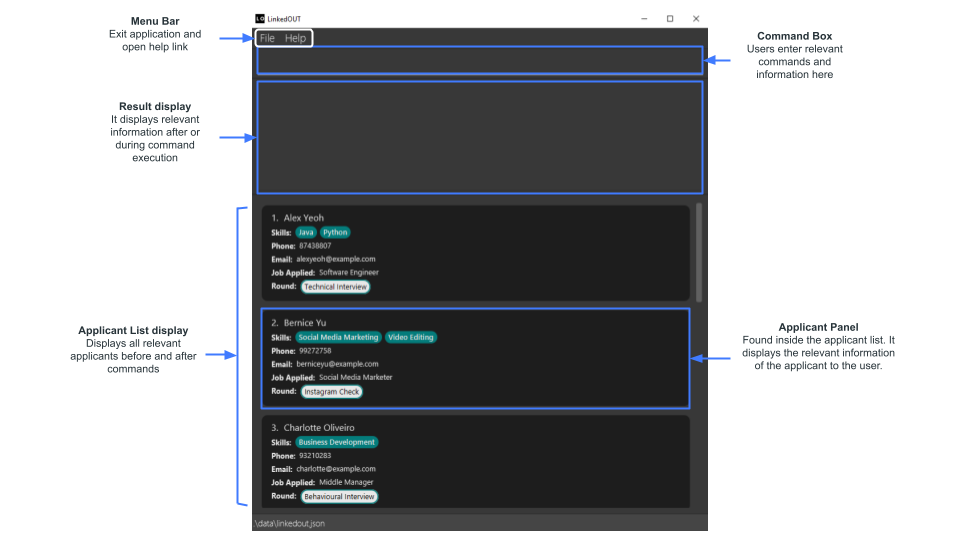

---
### Prefix and Input Summary

The table below illustrates the meaning of the prefixes and their respective inputs

| Prefix | Meaning                  | Input       | Constraints |
|:-------|:-------------------------|:------------|:------------|
|   -    |                          | INDEX       | Index of applicant specified must not be more than the total number of applicants in the list. |
| **n/** | Applicant's Name         | NAME        | Names can only contain Unicode characters, and cannot contain any numbers. Name's can contain the following special characters: `-` and`'`. **An applicant's name is unique** i.e. two applicants cannot have the same name.
| **p/** | Applicant's Phone Number | PHONE_NUMBER| Phone numbers must only contain numbers, and must be between 3 and 15 characters long.
| **e/** | Applicant's Email        | EMAIL       | Emails should be of the format `local-part@domain`.
| **j/** | Job Applied              | JOB         | Jobs must only contain alphanumeric characters.
| **r/** | Application Round        | ROUND       | Rounds must only contain alphanumeric characters.
| **s/** | Applicant's Skill        | SKILL       | A single skill can be made up of 1 to 5 words. The skill cannot be completely made up of symbols. However, a mix of alphanumeric and symbols are allowed. eg. `!@#` is not allowed but `C#` is allowed.
| **f/** | Field to sort by         | FIELD       | Field to sort list of applicant by can only be either `NAME` or `JOB` (case-insensitive).
| **o/** | Order for sorting        | ORDER       | Order to sort list by can only be either `ASC`, ascending order or `DESC`, descending order (case-insensitive).

[Back to top ](#table-of-contents)

---
### Viewing help : `help`

Shows you a message explaining how to access the help page.

<br>

Format: `help`

<br>

Example:
```
help
```
Sample Output:


[Back to top ](#table-of-contents)

---
### Adding an applicant: `add`

Allows you to add a new applicant to the LinkedOUT application with the following information:
* `NAME`: Applicant's name
* `PHONE_NUMBER`: Applicant's phone number
* `EMAIL`: Applicant's email
* `JOB`: The job the applicant applied for
* `ROUND`: The round of job application that the applicant is at
* `SKILL`: Particular skills the applicant may have

<br>

Format:
```
add n/NAME p/PHONE_NUMBER e/EMAIL j/JOB r/ROUND [s/SKILL]…​
```

<br>

Example:
```
add n/Bob p/99999999 e/bob@example.com j/Data Analyst r/Interview s/Pandas s/Python
```
Sample Output:

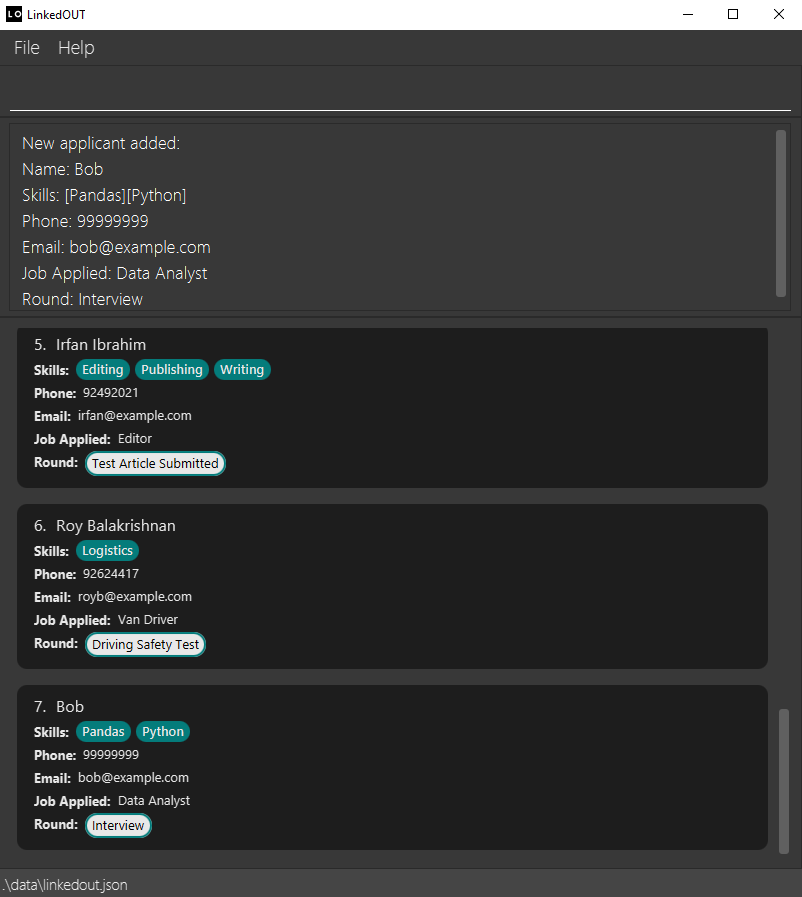

[Back to top ](#table-of-contents)

---
### Listing all applicants : `list`

Allows you to list out all job applicants, along with an overview of each applicant.

<br>

Format:
```
list
```

<br>

Example:
```
list
```
Sample Output:

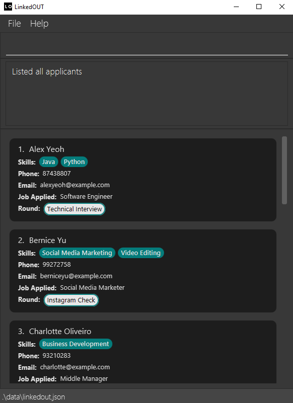

[Back to top ](#table-of-contents)

---
### Viewing a specific applicant : `view`

Allows you to view an overview of a specific applicant, specified by an applicant's full name.

<br>

Format:
```
view NAME
```
* You must provide an exact match of an applicant's full name in order to view their details.<br>
  e.g. If an applicant's full name is `Steve Jobs`, and the command provided is `view Steve` then LinkedOUT will not
  display `Steve Jobs`'s details. <br>
* The view command is case-insensitive. <br>
  e.g `hans` will match `Hans`.
* Only full name will be matched. <br>
  e.g. `Han Lee` will not match `Han`.
* Only exact full name with correct spacing will be matched. <br>
  e.g. `HanLee` will not match `Han Lee`.

<br>

Example:
```
view Bernice Yu
```
Sample Output:

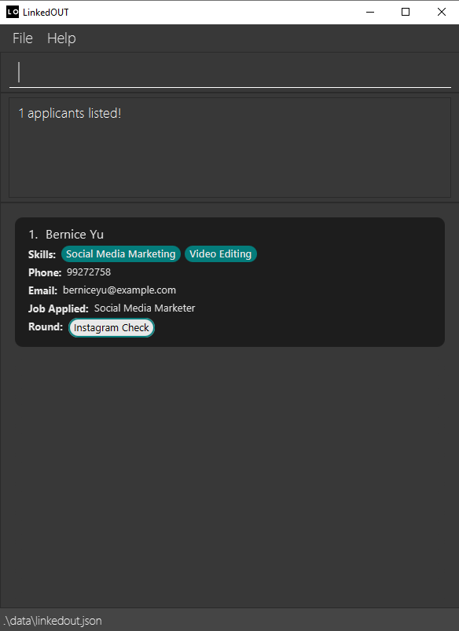

[Back to top ](#table-of-contents)

---
### Searching for an applicant : `search`

Allows you to search for applicants containing specified keywords, these keywords could be in **any** of the 
applicant's name, job, round or skills.

<br>

Format:
```
search [n/NAME]…​ [j/JOB]…​ [r/ROUND]…​ [s/SKILL]…​
```

<div markdown="span" class="alert alert-primary">:bulb: **Tip:**
You can try searching for multiple attributes in the applicant list. Try `search n/Alex s/Java` to search for applicants with 
the name `Alex` or skill `Java`!
</div>

<br>

Example:
```
search n/Roy s/Java
```
Sample Output:

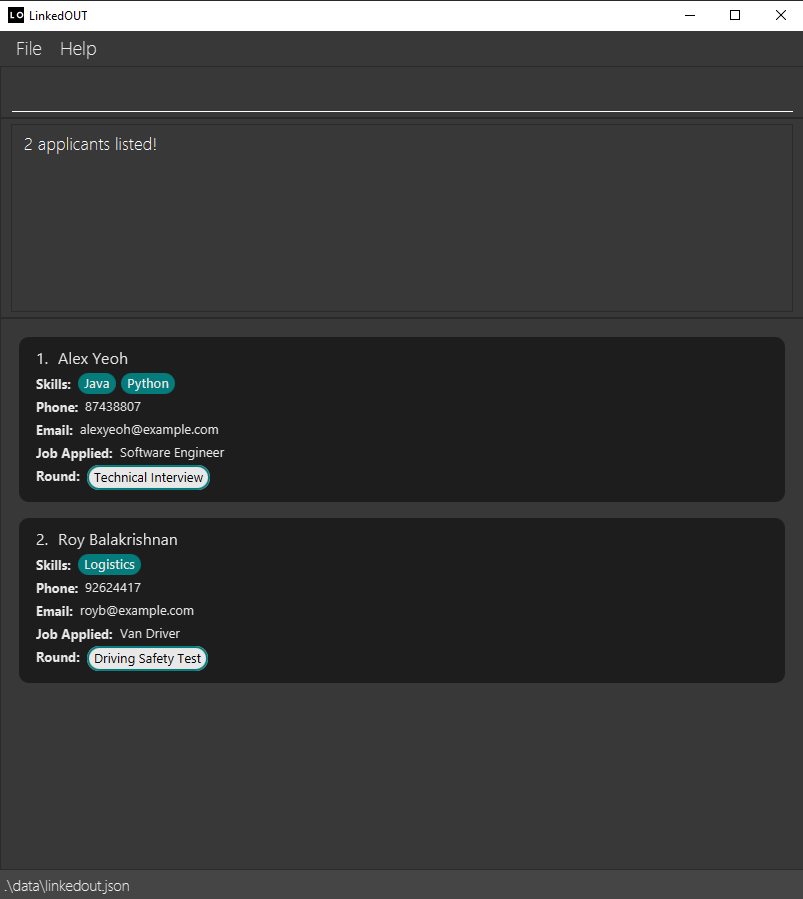

[Back to top ](#table-of-contents)

---
### Adding skills to an applicant: `addskill`

Allows you to add skills to a specific applicant. The index number used corresponds to the one in the displayed applicant list. This command does not replace any pre-existing skills.

<br>

Format:
```
addskill INDEX [s/SKILL]...
```

* Only valid indexes with an applicant is edited. <br>
  e.g If there are only `4` applicants in the app but `5` is specified, then the intended action will not be carried out.
* Only positive indexes are edited. <br>
  e.g As we label our applicants incrementally starting from `1` (e.g `1, 2, 3, and so on`), an index of `-1` will not be tagged to an applicant.
* If you would like to replace or remove certain skills instead, consider using [`edit`](https://ay2122s2-cs2103t-t09-2.github.io/tp/UserGuide.html#editing-an-applicant--edit).

<br>

Example:
```
addskill 1 s/React s/Vue
```
Sample Output:

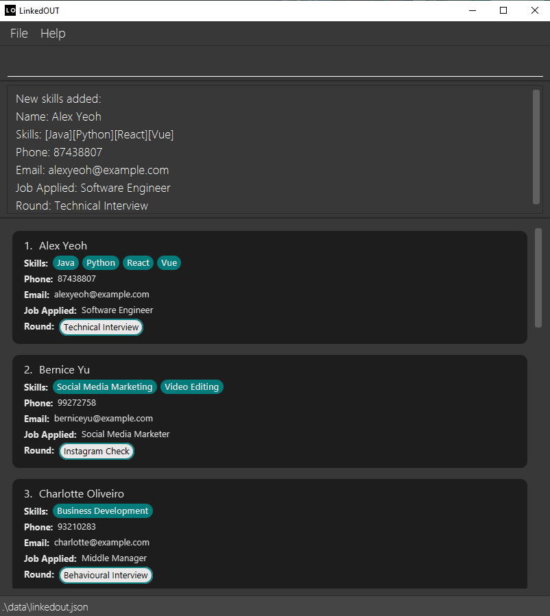

[Back to top ](#table-of-contents)

---
### Editing an applicant : `edit`

Allows you to edit specific details of the applicant identified by the index number. The index number used corresponds to the one in the displayed applicant list. 
Existing values will be overwritten by the input values.

<br>

Format:
```
edit INDEX [n/NAME] [p/PHONE] [e/EMAIL] [j/JOB] [r/ROUND] [s/SKILL]…​
```

* Only valid index with an applicant is edited. <br>
  e.g If there are only `4` applicants in the app but `5` is specified, then the intended action will not be carried out.
* Only positive indexes are edited. <br>
  e.g As we label our applicants incrementally starting from `1` (e.g `1, 2, 3, and so on`), an index of `-1` will not be tagged to an applicant.
* As an applicant can have more than 1 skill, you may remove skills using `edit` as illustrated by the following example: <br>
  e.g An applicant has skills `Excel`, `Word`, `Docs`. To remove the skill `Excel`, you may type the following command. `edit INDEX s/Word s/Docs`.
* You may also add skills using `edit`. However, a simpler way of doing so would be to use our alternative command [`addskill`](https://ay2122s2-cs2103t-t09-2.github.io/tp/UserGuide.html#adding-skills-to-an-applicant-addskill).
  <br> To add skills with `edit`, you may do so as illustrated by the following example: <br>
  e.g An applicant has skill `Excel`. To add the skills `Word` and `Docs`, you may type the following command. `edit INDEX s/Excel s/Word s/Docs`.
* You can remove all of an applicant's skills by simply typing `edit INDEX s/` without adding anything behind `s/`. <br>
  <div markdown="span" class="alert alert-warning">:exclamation: **Caution:**
  This will clear all skills previously added for an applicant and cannot be undone. 
* At least one attribute must be provided to be edited. i.e. `edit INDEX` is an invalid command. 
  </div>

<br>

Example:
```
edit 1 p/91234567 e/yeoh.99@example.com s/Rust
```
Sample Output:

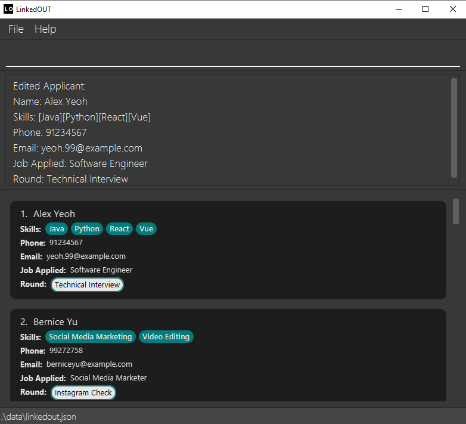

[Back to top ](#table-of-contents)

---
### Sorting applicants : `sort`

Allows you to sort the list of applicants **temporarily** by name or by job. That is to say, the list will not stay sorted if you were to use other commands following sort.
You can sort based on ascending or descending order.

<br>

Format:
```
sort f/FIELD o/ORDER
```

* You must provide either `NAME` or `JOB` as field to be sorted, both are case-insensitive <br>
  e.g if the field is `NAME`, then the list will be sorted based on applicant's name in the order given.
* You must provide either `ASC` or `DESC` for order, both are case-insensitive.
`ASC` stands for ascending and `DESC` stands for descending <br>
  e.g if the order is `ASC`, then the list will be sorted in ascending order based on the field given


<br>

Example:
```
sort f/job o/asc
```
Sample Output:

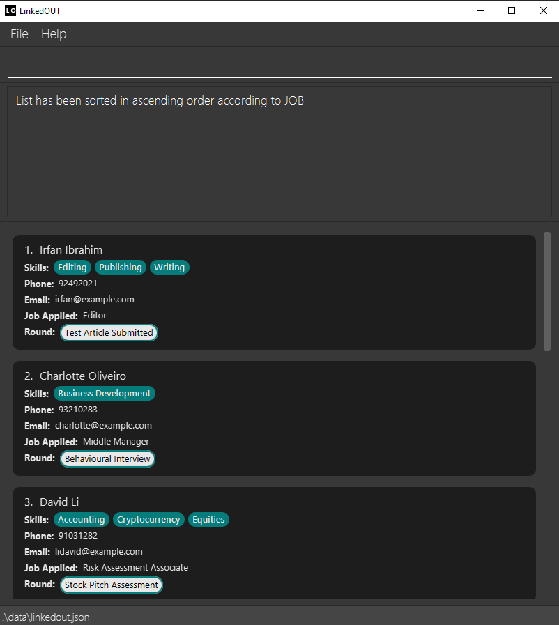

[Back to top ](#table-of-contents)

---
### Flagging an applicant : `flag`

Allows you to flag an applicant identified by the index number. The index number used corresponds to the one in the displayed applicant list. Flagged applicants will appear at the top of the list and are identified with a flag symbol.

<br>

Format:
```
flag INDEX
```

* Only valid index with an applicant is flagged. <br>
  e.g If there are only `4` applicants in the app but `5` is specified, then the intended action will not be carried out.
* Only positive indexes are flagged. <br>
  e.g As we label our applicants incrementally starting from `1` (e.g `1, 2, 3, and so on`), an index of `-1` will not be tagged to an applicant.
* Flag acts like a toggle. To un-flag the applicant, you may simply re-type the same command.

<div markdown="span" class="alert alert-primary">:bulb: **Tip:**
Try flagging the first applicant by typing `flag 1`. You should see it at the top with a flag symbol. Then try un-flagging the same applicant with `flag 1`.
</div>

<br>

Example:
```
flag 1
```
Sample Output:

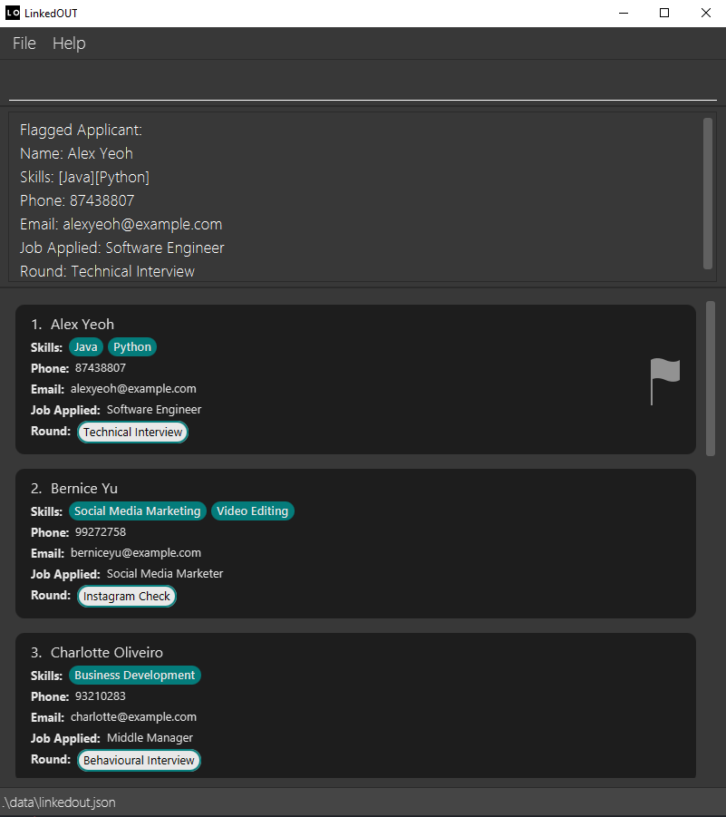

<br>

Extended Example for unflagging:
```
flag 1
```

Extended Sample Output for unflagging:


<br>

<div markdown="block" class="alert alert-info">

**:information_source: Flag Command Interaction with Other Commands:**

* `INDEX` of applicant to be flagged/unflagged always follows the index indicated on the user interface. <br>
e.g After executing a search, sort or view command, `flag 1` still flags/unflags the applicant at the top of the list. 
* A flagged applicant acts like a pinned email, and will always be located at the top of the applicant list,
except after search and view commands. <br>
  In that case, flagged applicants will be displayed according to the command's sorting order,
  and will no longer be displayed at the top.
  * e.g After a sort command, flagged applicants are not displayed at the top of the list and will be displayed according to the order 
  specified in the command. 
  * e.g After a search command, applicants will be displayed in order of which applicants most satisfy the search conditions.

</div>

[Back to top ](#table-of-contents)

---
### Deleting an applicant : `delete`

Allows you to delete a specific applicant, specified by index.

<br>

Format:
```
delete INDEX
```

* Only valid index with an applicant is deleted. <br>
  e.g If there are only `4` applicants in the app but `5` is specified, then the intended action will not be carried out.
* Only positive indexes are deleted. <br>
  e.g As we label our applicants incrementally starting from `1` (e.g `1, 2, 3, and so on`), an index of `-1` will not be tagged to an applicant.

<br>

Example:
```
delete 1
```
Sample Output:

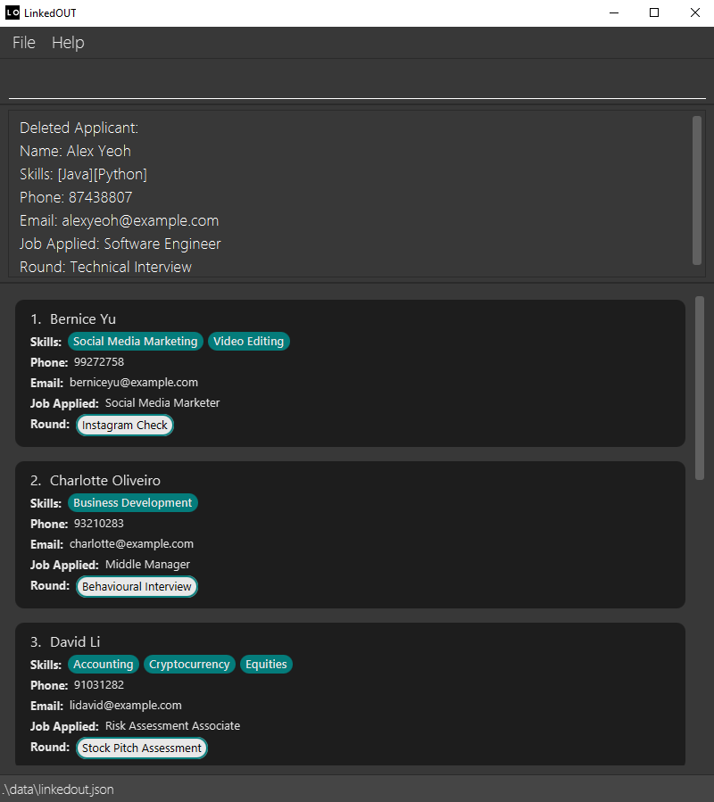

<div markdown="span" class="alert alert-warning">:exclamation: **Caution:**
If you delete a specific applicant, LinkedOUT will permanently discard the applicant's data 
</div>

[Back to top ](#table-of-contents)

---
### Clearing the applicants : `clear`

Clears the list of applicants

<br>

Format: `clear`

<br>

Example:
```
clear 
```

Sample Output:

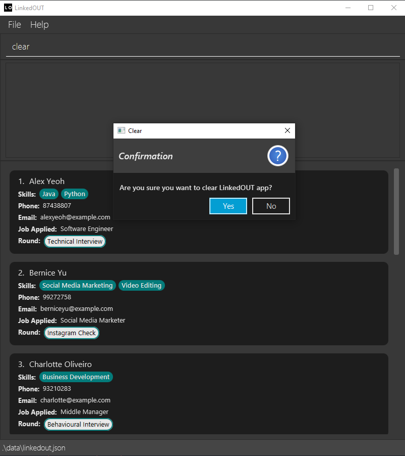


<div markdown="span" class="alert alert-warning">:exclamation: **Caution:**
LinkedOUT will discard all data and start with an empty data file once you select 'Yes' on the confirmation box. Selecting 'No' will cancel the action.
</div>

[Back to top ](#table-of-contents)

---
### Exiting the program : `exit`

Exits the program.

<br>

Format: `exit`

Example:
```
exit
```

[Back to top ](#table-of-contents)

---
### Saving the data

LinkedOUT data is saved in the hard disk automatically after any command that changes the data. There is no need to save manually.

[Back to top ](#table-of-contents)

---
### Editing the data file

LinkedOUT data is saved in `[JAR file location]/data/linkedout.json`. Advanced users are welcome to update data directly by editing that data file.

<div markdown="span" class="alert alert-warning">:exclamation: **Caution:**
If your changes to the data file makes its format invalid, LinkedOUT will discard all data and start with an empty data file on the next run.
</div>

[Back to top ](#table-of-contents)

--------------------------------------------------------------------------------------------------------------------

## FAQ

**Q**: How do I transfer my data to another Computer?<br>
**A**: You may first install the app in another computer. Then, you may overwrite the empty data file it creates with the file containing data from the previous LinkedOUT home folder.

[Back to top ](#table-of-contents)

--------------------------------------------------------------------------------------------------------------------

## Glossary

* **GUI**: Graphical User Interface: Refers to the user interface that the user interacts with.
* **CLI**: Command Line Interface: Refers to a computer program that accepts text inputs.

[Back to top ](#table-of-contents)

---

## Command summary

| Action     | Format, Examples                                                                                                                                      |
|------------|-------------------------------------------------------------------------------------------------------------------------------------------------------|
| **Help**   | `help`                                                                                                                                                |
| **Add**    | `add n/NAME p/PHONE_NUMBER e/EMAIL j/JOB r/ROUND [s/SKILL]…​` <br> e.g: `add n/Bob p/99999999 e/bob@example.com j/Data Analyst r/Interview s/Pandas` |
| **List**   | `list`                                                                                                                                                |
| **View**   | `view NAME` <br> e.g: `view Steve Jobs`                                                                                                               |
| **Search** | `search [n/NAME]... [j/JOB]... [r/ROUND]... [s/SKILL]...` <br> e.g: `search n/Steve`   |
| **AddSkill** | `addskill INDEX [s/SKILL]....` <br> e.g `addskill 1 s/MySQL s/PostgreSQL`|
| **Edit**   | `edit INDEX [n/NAME] [p/PHONE] [e/EMAIL] [j/JOB] [r/ROUND] [s/SKILL]...` <br> e.g: `edit 1 n/Elon Musk`                                               |
| **Sort**   | `sort f/FIELD o/ORDER` <br/> e.g: `sort f/Name o/Asc`                                                                                                 |
| **Flag**   | `flag INDEX` <br> e.g:  `flag 1`                                                                                                                      |
| **Delete** | `delete INDEX` <br> e.g: `delete 1`                                                                                                                   |
| **Clear**  | `clear`                                                                                                                                               |
| **Exit**   | `exit`                                                                                                                                                |

[Back to top ](#table-of-contents)


