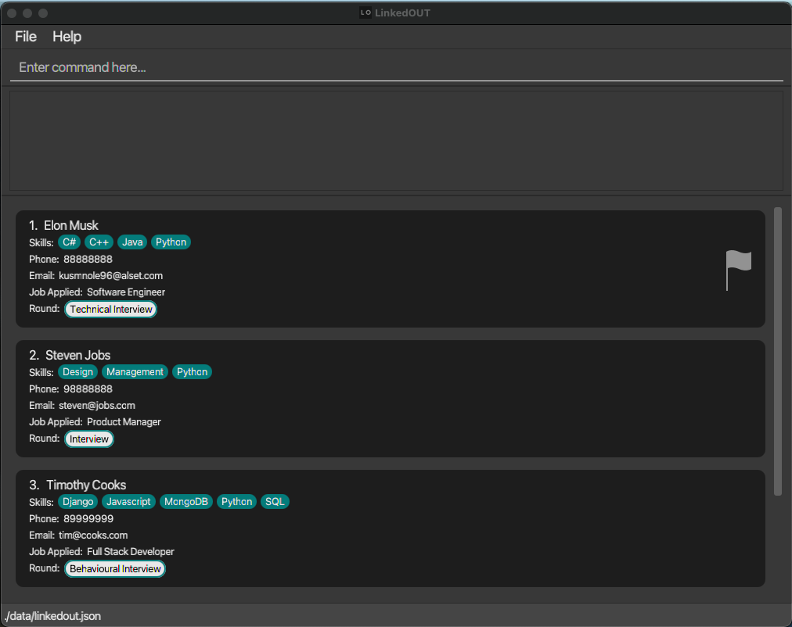

**LinkedOUT** is the only application that any **experienced recruiter needs.** \
It allows recruiters to **keep track of many applicants, and the job they applied for.** \
You can **store** their contact details, skills and the round of their application, **all in one place**.

* If you are interested in using LinkedOUT, the [**User Guide**](UserGuide.html) is a good place to start.
* If you are interested about developing LinkedOUT, the [**Developer Guide**](DeveloperGuide.html) is a good place to start.

**Acknowledgements**
* This project is based on the AddressBook-Level3 project created by the [SE-EDU initiative](https://se-education.org).
* Libraries used: [JavaFX](https://openjfx.io/), [Jackson](https://github.com/FasterXML/jackson), [JUnit5](https://github.com/junit-team/junit5)
